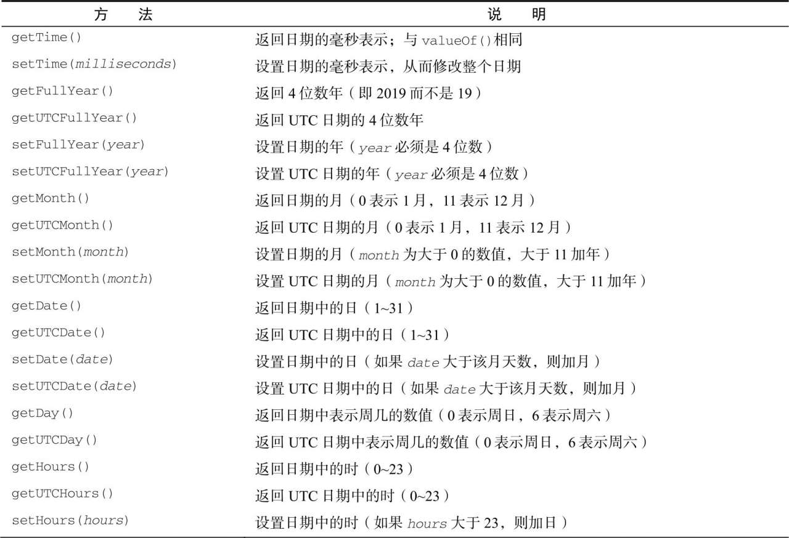
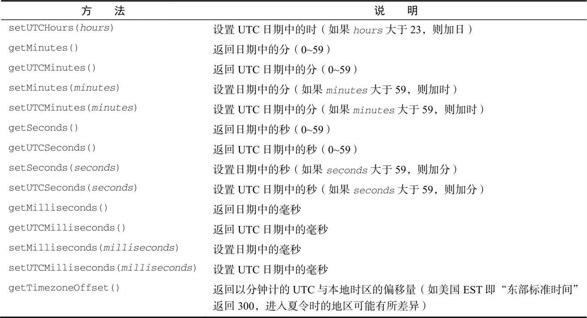
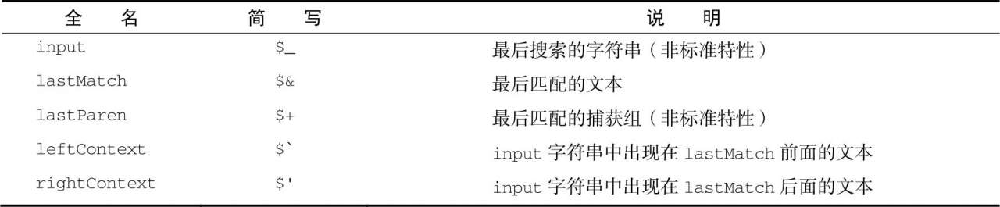
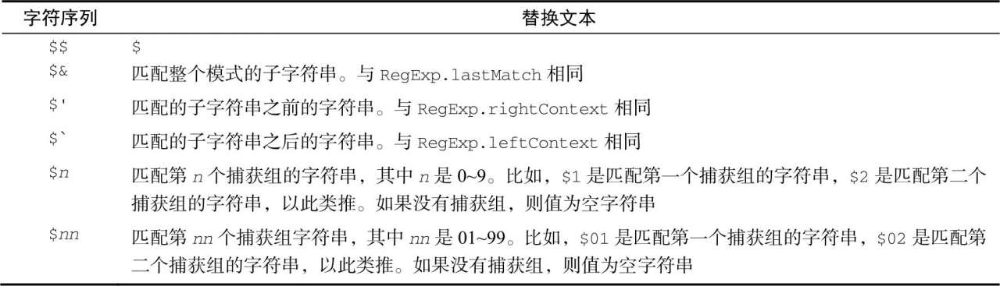
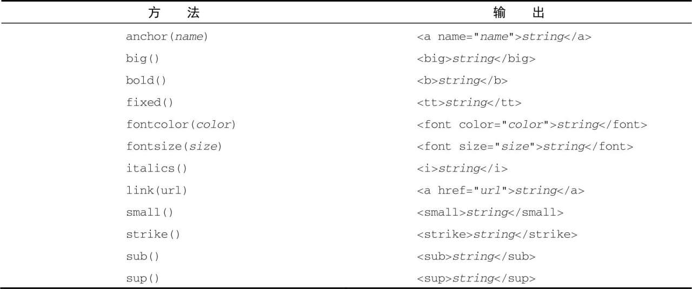
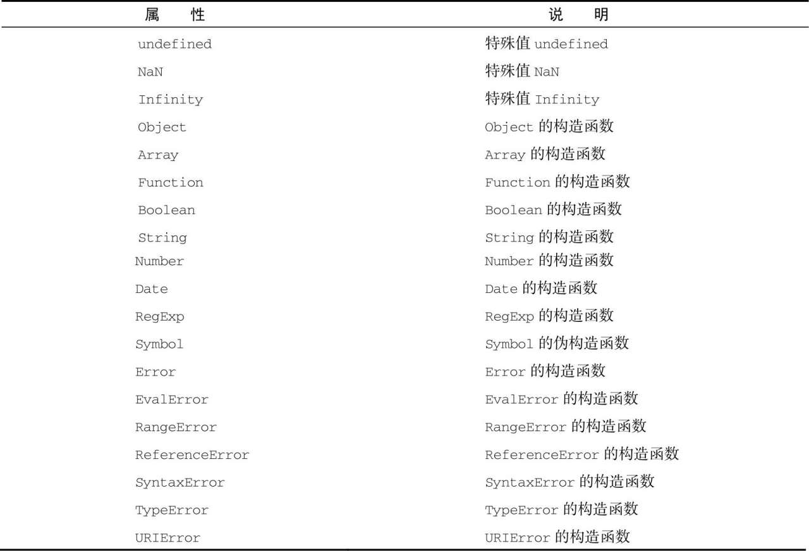
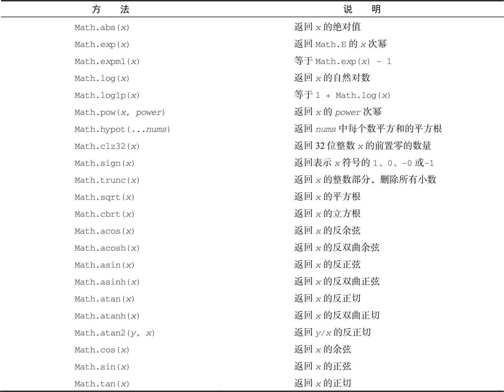

## Date

Date类型可以精确表示1970年1月1日之前及之后285616年的日期。

要创建日期对象，使用new操作符来调用Date构造函数:

`let now = new Date()`

### Date.parse

`Date.parse()`方法接收一个表示日期的字符串参数,所有实现都必须支持下列日期格式：

- “月/日/年”，如"5/23/2019"；
- “月名日，年”，如"May 23, 2019"；
- “周几 月名 日 年 时：分：秒 时区”，如"Tue May 232019 00:00:00GMT-0700"；
- ISO 8601扩展格式“YYYY-MM-DDTHH:mm:ss.sssZ”，如2019-05-23T00:00:00（只适用于兼容ES5的实现）。

### Date.UTC

`Date.UTC()`接收参数：
1. 年
2. 月 （起点为0）
3. 日
4. 时 （0~23）
5. 分
6. 秒
7. 毫秒

`Date.parse()` 和 `Date.UTC()` 方法返回值都为日期的毫秒数,两者都会被Date构造函数隐式调用。
区别:`Date.UTC()`创建的是本地日期， `Date.parse()`为GMT日期。

例:

```javascript
new Date(2021, 3, 28, 10, 52) // Wed Apr 28 2021 10:52:00 GMT+0800 (中国标准时间)
new Date('4/28/2021') // Wed Apr 28 2021 00:00:00 GMT+0800 (中国标准时间)
```

### Date.now

返回表示方法执行时日期和时间的毫秒数。
也可使用

- +new Date
- new Date().valueOf()
- new Date().getTime()
- Date.now()

使用运算符会隐式调用Date.prototype 的 valueOf方法

### 继承的方法

```javascript
new Date().toLocaleString()
'2021/4/28上午11:11:35'
new Date().toString()
'Wed Apr 28 2021 11:11:41 GMT+0800 (中国标准时间)'
new Date().toLocaleDateString()
'2021/4/28'
new Date().toLocaleTimeString()
'上午11:12:03'
new Date().toDateString()
'Wed Apr 28 2021'
new Date().toTimeString()
'11:15:14 GMT+0800 (中国标准时间)'
new Date().toUTCString()
'Wed, 28 Apr 2021 03:15:47 GMT'
```




## RegExp

字面量创建

`let expression = /pattern/flags;`

pattern可以是任何正则表达式,flags控制匹配模式。

- g：全局模式，表示查找字符串的全部内容，而不是找到第一个匹配的内容就结束。
- i：不区分大小写，表示在查找匹配时忽略pattern和字符串的大小写。
- m: 多行模式，表示查找到一行文本末尾时会继续查找。
- y：粘附模式，表示只查找从lastIndex开始及之后的字符串。
- u: Unicode模式，启用Unicode匹配。
- s:dotAll模式，表示元字符．匹配任何字符（包括\n或\r）。

RegExp构造函数创建

两个参数都为字符串
1. pattern 字符串形式的正则表达式
2. flags 字符串形式的匹配模式

与字面量创建等效，注意的是某些情况下需要二次转义, `\` 需要转义为 `'\\'`, `\\`则为`'\\\\'`。

### RegExp实例属性

RegExp实例有以下属性：

- global：布尔值，表示是否设置了g标记。
- ignoreCase：布尔值，表示是否设置了i标记。
- unicode：布尔值，表示是否设置了u标记。
- sticky：布尔值，表示是否设置了y标记。
- lastIndex：整数，表示在源字符串中下一次搜索的开始位置，始终从0开始。
- multiline：布尔值，表示是否设置了m标记。
- dotAll：布尔值，表示是否设置了s标记。
- source：正则表达式的字面量字符串（不是传给构造函数的模式字符串），没有开头和结尾的斜杠。
- flags：正则表达式的标记字符串。始终以字面量而非传入构造函数的字符串模式形式返回（没有前后斜杠）。

### RegExp实例原型上的方法

RegExp实例的主要方法是exec(),主要用于配合捕获组使用。这个方法只接收一个参数，即要应用模式的字符串。

#### exec

返回值：`Array`

- 0. 匹配整个模式的字符串
- 1~n. 捕获组匹配的字符串
- index 字符串中匹配模式的起始位置
- input 要查找的字符串

如为匹配到则返回null

##### 全局标记

g标记:每次调用exec()都会在字符串中向前搜索下一个匹配项。

y标记:和g标记类似，不同之处g修饰符只要剩余位置中存在匹配就可，而y修饰符确保匹配必须从剩余的第一个位置开始。

#### test

返回值: `Boolean`

参数: 要匹配的字符串。

### RegExp构造函数属性



- input属性中包含原始的字符串。
- leftConext属性包含原始字符串中"short"之前的内容，rightContext属性包含"short"之后的内容。
- lastMatch属性包含匹配整个正则表达式的上一个字符串，即"short"。
- lastParen属性包含捕获组的上一次匹配，即"s"。

RegExp还有其他几个构造函数属性，可以存储最多9个捕获组的匹配项。这些属性通过RegExp.$1~RegExp.$9来访问，分别包含第1~9个捕获组的匹配项。在调用exec()或test()时，这些属性就会被填充，然后就可以像下面这样使用它们。

```javascript
const text = 'this has been a short summer'
const pattern = /(..)or(.)/g
if (pattern.test(text)) {
  console.log(RegExp.$1) // sh
  console.log(RegExp.$2) // t
}
```

## 原始值包装类型

为了方便操作原始值，ECMAScript提供了3种特殊的引用类型：`Boolean`、`Number`和`String`。
每当用到某个原始值的方法或属性时，后台都会创建一个相应原始包装类型的对象，从而暴露出操作原始值的各种方法。

1. 创建一个String类型的实例；
2. 调用实例上的特定方法；
3. 销毁实例。

相当于：
```javascript
let s1 = new String('some text')
const s2 = s1.substring(2)
s1 = null
```

引用类型与原始值包装类型的主要区别在于对象的生命周期。在通过new实例化引用类型后，得到的实例会在离开作用域时被销毁，因此不能给原始值添加属性和方法。

如：
```javascript
const s1 = 'some text'
s1.color = 'red'
console.log(s1.color) // undefined
```

Object构造函数作为一个工厂方法，能够根据传入值的类型返回相应原始值包装类型的实例。如：
```javascript
const obj = new Object('some text')
console.log(obj instanceof String) // true
```

使用`new`调用原始值包装类型的构造函数，与调用同名的转型函数并不一样。如：

```javascript
const value = '25'
const number = Number(value) // 转型函数
console.log(typeof number) // "number"
const obj = new Number(value) // 构造函数
console.log(typeof obj) // "object"
```

### Boolean

两种声明方式，字面量声明和构造函数实例，建议前者。

Boolean的实例会重写`valueOf()`方法，返回一个原始值`true`或`false`。`toString()`方法被调用时也会被覆盖，返回字符串`"true"`或`"false"`。

```javascript
const falseObject = new Boolean(false)
let result = falseObject && true
console.log(result) // true
const falseValue = false
result = falseValue && true
console.log(result) // false
console.log(typeof falseObject) // object
console.log(typeof falseValue) // boolean
console.log(falseObject instanceof Boolean) // true
console.log(falseValue instanceof Boolean) // false
```

### Number

与`Boolean`类型一样，`Number`类型重写了`valueOf()`、`toLocaleString()`和`toString()`方法。`valueOf()`方法返回Number对象表示的原始数值，另外两个方法返回数值字符串。`toString()`方法可选地接收一个表示基数的参数，并返回相应基数形式的数值字符串。

```javascript
const num = 10
console.log(num.toString()) // "10"
console.log(num.toString(2)) // "1010"
console.log(num.toString(8)) // "12"
console.log(num.toString(10)) // "10"
console.log(num.toString(16)) // "a"
```

其他方法：

- `toFixed()`方法返回包含指定小数点位数的数值字符串。
- `toExponential()`用于格式化数值的方法,返回以科学记数法。
- `toPrecision()`方法会根据情况返回最合理的输出结果，可能是固定长度，也可能是科学记数法形式。
- `Number.isInteger()`方法，用于辨别一个数值是否保存为整数。

### String

`String`对象的方法可以在所有字符串原始值上调用。3个继承的方法`valueOf()`、`toLocaleString()`和`toString()`都返回对象的原始字符串值。

每个`String`对象都有一个`length`属性，表示字符串中字符的数量。

### 字符串操作方法

`concat()`用于将一个或多个字符串连接，更常用的是+操作符。

`slice()`、`substr()`和`substring()`可以从字符串中提取子字符串。

当参数为正数时`slice()`和`substring()`方法类似，参数都为截取起始位置和结束位置，而`substr()`的第二个参数则不同，为截取字符串长度。

当某个参数是负值时，这3个方法的行为又有不同。比如，`slice()`方法将所有负值参数都当成字符串长度加上负参数值。

而`substr()`方法将第一个负参数值当成字符串长度加上该值，将第二个负参数值转换为0。`substring()`方法会将所有负参数值都转换为0

```javascript
const stringValue = 'hello world'
console.log(stringValue.slice(-3)) // "rld"
console.log(stringValue.substring(-3)) // "hello world"
console.log(stringValue.substr(-3)) // "rld"
console.log(stringValue.slice(3, -4)) // "lo w"
console.log(stringValue.substring(3, -4)) // "hel"
console.log(stringValue.substr(3, -4)) // "" (empty string)
```

### 字符串位置方法

`indexOf()`和`lastIndexOf()`。这两个方法从字符串中搜索传入的字符串，并返回位置（如果没找到，则返回-1）。两者的区别在于，`indexOf()`方法从字符串开头开始查找子字符串，而`lastIndexOf()`方法从字符串末尾开始查找子字符串。

这两个方法都可以接收可选的第二个参数，表示开始搜索的位置。

在字符串中找到目标字符串:
```javascript
const stringValue = 'Lorem ipsum dolor sit amet, consectetur adipisicing elit'
const positions = new Array()
let pos = stringValue.indexOf('e')
while (pos > -1) {
  positions.push(pos)
  pos = stringValue.indexOf('e', pos + 1)
}
console.log(positions) // [3,24,32,35,52]
```

### 字符串包含方法

#### `startsWith()`、`endsWith()`和`includes()`

这些方法都会从字符串中搜索传入的字符串，并返回一个表示是否包含的布尔值。它们的区别在于，`startsWith()`检查开始于索引0的匹配项，`endsWith()`检查开始于索引`(string.length -substring.length)`的匹配项，而`includes()`检查整个字符串。

```javascript
const message = 'foobarbaz'
console.log(message.startsWith('foo')) // true
console.log(message.startsWith('bar')) // false
console.log(message.endsWith('baz')) // true
console.log(message.endsWith('bar')) // false
console.log(message.includes('bar')) // true
console.log(message.includes('qux')) // false
```

#### `startsWith()`和`includes()`

方法接收可选的第二个参数，表示开始搜索的位置。如果传入第二个参数，则意味着这两个方法会从指定位置向着字符串末尾搜索，忽略该位置之前的所有字符。

```javascript
const message = 'foobarbaz'
console.log(message.startsWith('foo')) // true
console.log(message.startsWith('foo', 1)) // false
console.log(message.includes('bar')) // true
console.log(message.includes('bar', 4)) // false
```

#### `endsWith()`

 方法接收可选的第二个参数，表示应该当作字符串末尾的位置。如果不提供这个参数，那么默认就是字符串长度。如果提供这个参数，那么就好像字符串只有那么多字符一样：

```javascript
const message = 'foobarbaz'
console.log(message.endsWith('bar')) // false
console.log(message.endsWith('bar', 6)) // true
```

####  `trim()`

用于创建字符串的一个副本，删除前、后所有空格符，再返回结果。
另外，`trimLeft()`和`trimRight()`方法分别用于从字符串开始和末尾清理空格符。

#### `repeat()`

这个方法接收一个整数参数，表示要将字符串复制多少次，然后返回拼接所有副本后的结果。

#### `padStart()`和`padEnd()`

padStart()和padEnd()方法会复制字符串，如果小于指定长度，则在相应一边填充字符，直至满足长度条件。这两个方法的第一个参数是长度，第二个参数是可选的填充字符串，默认为空格。

#### 字符串迭代与解构

字符串的原型上暴露了一个@@iterator方法，表示可以迭代字符串的每个字符。可以像下面这样手动使用迭代器：

```javascript
const message = 'abc'
const stringIterator = message[Symbol.iterator]()
console.log(stringIterator.next()) // {value: "a", done: false}
console.log(stringIterator.next()) // {value: "b", done: false}
console.log(stringIterator.next()) // {value: "c", done: false}
console.log(stringIterator.next()) // {value: undefined, done: true}
```

在for-of循环中可以通过这个迭代器按序访问每个字符。有了这个迭代器之后，字符串就可以通过解构操作符来解构了。

#### 字符串大小写转换

`toLowerCase()`、`toLocaleLowerCase()`、`toUpperCase()`和`toLocaleUpperCase()`。通常，如果不知道代码涉及什么语言，则最好使用地区特定的转换方法。

#### 字符串模式匹配方法

##### `match()`

这个方法本质上跟RegExp对象的exec()方法相同。match()方法接收一个参数，可以是一个正则表达式字符串，也可以是一个RegExp对象。

##### `search()`

这个方法唯一的参数与match()方法一样：正则表达式字符串或RegExp对象。这个方法返回模式第一个匹配的位置索引，如果没找到则返回-1。search()始终从字符串开头向后匹配模式。

##### `replace()`

这个方法接收两个参数，第一个参数可以是一个RegExp对象或一个字符串（这个字符串不会转换为正则表达式），第二个参数可以是一个字符串或一个函数。要想替换所有子字符串，第一个参数必须为正则表达式并且带全局标记,或者使用`replace()`方法。

第二个参数是字符串的情况下，有几个特殊的字符序列，可以用来插入正则表达式操作的值。



第二个参数可以是一个函数。在只有一个匹配项时，这个函数会收到3个参数：与整个模式匹配的字符串、匹配项在字符串中的开始位置，以及整个字符串。在有多个捕获组的情况下，每个匹配捕获组的字符串也会作为参数传给这个函数，但最后两个参数还是与整个模式匹配的开始位置和原始字符串。这个函数应该返回一个字符串，表示应该把匹配项替换成什么。使用函数作为第二个参数可以更细致地控制替换过程：

```javascript
function htmlEscape(text) {
  return text.replace(/[<>"&]/g, (match, pos, originalText) => {
    switch (match) {
      case '<':
        return '&lt; '
      case '>':
        return '&gt; '
      case '&':
        return '&amp; '
      case '"':
        return '&quot; '
    }
  })
}
console.log(htmlEscape('<p class="greeting">Hello world! </p>'))
// "&lt; p class=&quot; greeting&quot; &gt; Hello world! </p>"
```

##### `split()`

根据传入的分隔符将字符串拆分成数组。参数可以是字符串也可以是RegExp对象。

#### `localeCompare()`

这个方法比较两个字符串，返回如下3个值中的一个。

- 如果按照字母表顺序，字符串应该排在字符串参数前头，则返回负值。（通常是-1，具体还要看与实际值相关的实现。）
- 如果字符串与字符串参数相等，则返回0。
- 如果按照字母表顺序，字符串应该排在字符串参数后头，则返回正值。（通常是1，具体还要看与实际值相关的实现。）

```javascript
const stringValue = 'yellow'
console.log(stringValue.localeCompare('brick')) // 1
console.log(stringValue.localeCompare('yellow')) // 0
console.log(stringValue.localeCompare('zoo')) // -1
```

### HTML方法(基本上弃用)



## 单例内置对象

任何由ECMAScript实现提供、与宿主环境无关，并在ECMAScript程序开始执行时就存在的对象(无需实例化)。
### Global

在全局作用域中定义的变量和函数都会变成Global对象的属性。除了`isNaN()`、`isFinite()`、`parseInt()`和`parseFloat()`之类的方法外还有另外一些方法。

#### URL编码方法

编码方法：

`encodeURI()`和`encodeURIComponent()`方法用于编码统一资源标识符（URI），以便传给浏览器。有效的URI不能包含某些字符，比如空格。

`encodeURI()`不会编码属于URL组件的特殊字符，比如冒号、斜杠、问号、井号，而`encodeURIComponent()`会编码它发现的所有非标准字符。

解码方法：

`decodeURI()`只对使用`encodeURI()`编码过的字符解码，

`decodeURIComponent()`解码所有被`encodeURIComponent()`编码的字符。

```javascript
const uri = 'http://www.wrox.com/illegal value.js#start'
// "http://www.wrox.com/illegal%20value.js#start"
console.log(encodeURI(uri))
// "http%3A%2F%2Fwww.wrox.com%2Fillegal%20value.js%23start"
console.log(encodeURIComponent(uri))
```

#### `eval()`

这个方法就是一个完整的ECMAScript解释器，它接收一个参数，即一个要执行的ECMAScript（JavaScript）字符串。

通过`eval()`定义的任何变量和函数都不会被提升，这是因为在解析代码的时候，它们是被包含在一个字符串中的。它们只是在`eval()`执行的时候才会被创建。

>解释代码字符串的能力是非常强大的，但也非常危险。在使用`eval()`的时候必须极为慎重，特别是在解释用户输入的内容时。因为这个方法会对XSS利用暴露出很大的攻击面。恶意用户可能插入会导致你网站或应用崩溃的代码。

#### Global对象属性



#### window对象

浏览器将`window`对象实现为`Global`对象的代理,所有全局作用域中声明的变量和函数都变成了`window`的属性。

### Math

ECMAScript提供了`Math`对象作为保存数学公式、信息和计算的地方。`Math`对象提供了一些辅助计算的属性和方法。

> 注意 `Math`对象上提供的计算要比直接在JavaScript实现的快得多。

#### Math对象属性


#### Math对象方法

- min()
- max()
- Math.ceil()
- Math.floor()
- Math.round()
- Math.fround() 返回数值最接近的单精度（32位）浮点值表示。
- random()

其他方法


