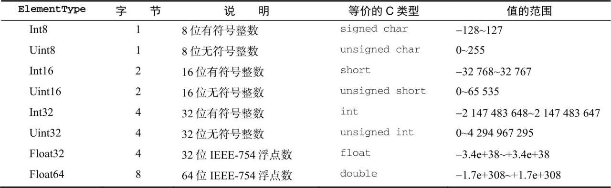

## Object

显式地创建`Object`的实例有两种方式。第一种是使用`new`操作符和`Object`构造函数:

```javascript
const person = new Object()
person.name = 'Nicholas'
person.age = 29
```

另一种方式是使用对象字面量（object literal）表示法。
属性名会被自动转换为字符串。

```javascript
const person = {
  name: 'Nicholas',
  age: 29
}
```

> 在使用对象字面量表示法定义对象时，并不会实际调用`Object`构造函数。

访问属性:

```javascript
const name = 'name'
person.name === person[name] // true
```

通常，点语法是首选的属性存取方式，除非访问属性时必须使用变量。

## Array

### 创建数组

显式地创建`Array`的实例有两种方式。第一种是使用`new`操作符和`Array`构造函数:

```javascript
const colors = new Array()
```

传入一个参数,当参数为数字时会被定义为`length`属性:

```javascript
Array.from({ length: 20 }) // [empty × 20] length: 20
```

也可以给Array构造函数传入要保存的元素。

```javascript
const colors = new Array('red', 'blue', 'green')
```

在使用Array构造函数时，也可以省略new操作符。结果是一样的。

```javascript
const colors = new Array('red', 'blue', 'green')
```

另一种创建数组的方式是使用数组字面量（array literal）表示法。

```javascript
const colors = ['red', 'blue', 'green']
```

> 与对象一样，在使用数组字面量表示法创建数组不会调用`Array`构造函数。

`Array`构造函数还有两个`ES6`新增的用于创建数组的静态方法：`from()`和`of()`。`from()`用于将类数组结构转换为数组实例，而`of()`用于将一组参数转换为数组实例。

`Array.from()`第二个参数相当于数组的`map`方法：

```javascript
Array.from(new Set([1, 2, 3]), item => String(item).padStart(2, 0)) //  ["01", "02", "03"]
```

第三个参数用于绑定`this`(箭头函数不适用):

```javascript
Array.from(new Set([1, 2, 3]), function (item) {
  return this.num + String(item)
}, { num: 0 }) //  ["01", "02", "03"]
```

`Array.of()`用于替代`Array.prototype.slice.call(arguments)`:

```javascript
Array.of(1, 2, 3) // [1,2,3]
```

### 数组空位

可以使用以下方法创建空位数组:

```javascript
const options = [1,,,,5] // [1, empty × 3, 5] length: 5
```

ES6之前的方法遍历时会自动忽略掉`empty`元素,`empty`本质上就是`undefined`;

```javascript
options.map(item => item === 'undefined') // [false, empty × 3, false];
options.join(',') // "1,,,,5" join会视为空串

for (const option of options) {
  console.log(option === 'undefined')
}
// false
// true × 3
// false
```

> 由于行为不一致和存在性能隐患，因此实践中要避免使用数组空位。如果确实需要空位，则可以显式地用undefined值代替。

### 数组索引

获取或设置数组元素可以使用中括号并提供相应值的数字索引:

```javascript
const colors = ['red', 'blue', 'green']
colors[0] // 'red'
```

数组的`length`并不是只读的，因此通过`length`属性可以从数组末尾删除或添加元素。

```javascript
colors.length = 2
colors // ['red','blue']
colors.length = 10
colors // ['red','blue', empty × 8]
```

在数组的`length`位上设置元素就相当于`Array.prototype.push()`

```javascript
colors[colors.length] = '11'
colors // ['red','blue', empty × 8, 11]
```

> 数组最多可以包含4294967295个元素，这对于大多数编程任务应该足够了。如果尝试添加更多项，则会导致抛出错误。以这个最大值作为初始值创建数组，可能导致脚本运行时间过长的错误。

```javascript
Array.from({ length: 4294967295 }) // [empty × 4294967295]
Array.from({ length: 4294967296 }) // Uncaught RangeError: Invalid array length
```

### 检测数组

在只有一个网页（因而只有一个全局作用域）的情况下可使用`instanceof`判断是否是数组。

```javascript
Array.isArray([]) // true
```

如果网页里有多个框架，则可能涉及两个不同的全局执行上下文，因此就会有两个不同版本的Array构造函数,可以使用Array.isArray()方法确定数组。

```javascript
Array.isArray([]) // true
```

### 迭代器方法

- `keys()`返回索引迭代器
- `values()`返回元素迭代器
- `entries()`返回索引/值对的迭代器

```javascript
const a = ['foo', 'bar', 'baz', 'qux']
// 因为这些方法都返回迭代器，所以可以将它们的内容
// 通过Array.from()直接转换为数组实例
const aKeys = Array.from(a.keys())
const aValues = Array.from(a.values())
const aEntries = Array.from(a.entries())
console.log(aKeys) // [0, 1, 2, 3]
console.log(aValues) // ["foo", "bar", "baz", "qux"]
console.log(aEntries) // [[0, "foo"], [1, "bar"], [2, "baz"], [3, "qux"]]
```

> 虽然这些方法是ES6规范定义的，但在2017年底的时候仍有浏览器没有实现它们。

### 复制和填充方法

`fill()`静默忽略超出数组边界、零长度及方向相反的索引范围。

```javascript
const zeroes = [0, 0, 0, 0, 0]
// 用5 填充整个数组
zeroes.fill(5)
console.log(zeroes) // [5, 5, 5, 5, 5]
zeroes.fill(0) // 重置
// 用6 填充索引大于等于3 的元素
zeroes.fill(6, 3)
console.log(zeroes) // [0, 0, 0, 6, 6]
zeroes.fill(0) // 重置
// 用7 填充索引大于等于1 且小于3 的元素
zeroes.fill(7, 1, 3)
console.log(zeroes) // [0, 7, 7, 0, 0];
zeroes.fill(0) // 重置
// 用8 填充索引大于等于1 且小于4 的元素
// (-4 + zeroes.length = 1)
// (-1 + zeroes.length = 4)
zeroes.fill(8, -4, -1)
console.log(zeroes) // [0, 8, 8, 8, 0];
// 索引过低，忽略
zeroes.fill(1, -10, -6)
console.log(zeroes) // [0, 0, 0, 0, 0]
// 索引过高，忽略
zeroes.fill(1, 10, 15)
console.log(zeroes) // [0, 0, 0, 0, 0]
// 索引反向，忽略
zeroes.fill(2, 4, 2)
console.log(zeroes) // [0, 0, 0, 0, 0]
```

`copyWithin()`按照指定范围浅复制数组中的部分内容，然后将它们插入到指定索引开始的位置。

```javascript
let ints
const reset = () => ints = [0, 1, 2, 3, 4, 5, 6, 7, 8, 9]
reset()
// 从ints中复制索引0 开始的内容，插入到索引5 开始的位置
// 在源索引或目标索引到达数组边界时停止
ints.copyWithin(5)
console.log(ints) // [0, 1, 2, 3, 4, 0, 1, 2, 3, 4]
reset()
// 从ints中复制索引5 开始的内容，插入到索引0 开始的位置
ints.copyWithin(0, 5)
console.log(ints) // [5, 6, 7, 8, 9, 5, 6, 7, 8, 9]
reset()
// 从ints中复制索引0 开始到索引3 结束的内容
// 插入到索引4 开始的位置
ints.copyWithin(4, 0, 3)
console.log(ints) // [0, 1, 2, 3, 0, 1, 2, 7, 8, 9]
reset()
// JavaScript引擎在插值前会完整复制范围内的值
// 因此复制期间不存在重写的风险
ints.copyWithin(2, 0, 6)
console.log(ints) // [0, 1, 0, 1, 2, 3, 4, 5, 8, 9]
reset()
// 支持负索引值，与fill()相对于数组末尾计算正向索引的过程是一样的
ints.copyWithin(-4, -7, -3)
console.log(ints) // [0, 1, 2, 3, 4, 5, 3, 4, 5, 6]
```

`copyWithin()`静默忽略超出数组边界、零长度及方向相反的索引范围。

```javascript
let ints
const reset = () => ints = [0, 1, 2, 3, 4, 5, 6, 7, 8, 9]
reset()
// 索引过低，忽略
ints.copyWithin(1, -15, -12)
console.log(ints) // [0, 1, 2, 3, 4, 5, 6, 7, 8, 9];
reset()
// 索引过高，忽略
ints.copyWithin(1, 12, 15)
console.log(ints) // [0, 1, 2, 3, 4, 5, 6, 7, 8, 9];
reset()
// 索引反向，忽略
ints.copyWithin(2, 4, 2)
console.log(ints) // [0, 1, 2, 3, 4, 5, 6, 7, 8, 9];
reset()
// 索引部分可用，复制、填充可用部分
ints.copyWithin(4, 7, 10)
console.log(ints) // [0, 1, 2, 3, 7, 8, 9, 7, 8, 9];
```

### 转换方法

`valueOf()`返回的是数组本身，`toString()`返回每个值的等效字符串拼接而成的一个逗号分隔的字符串，`toLocaleString()`与`toString()`类似，不同的是会调用每个值的`toLocaleString()`。

```javascript
[1, '2', 3].valueOf(); // [1, "2", 3]
[1, '2', 3].toString() // "1,2,3"
const pe = {
  toLocaleString() { return 'toLocaleString' },
  toString() { return 'toString' }
};
[pe].toLocaleString() // toLocaleString
```

> 如果数组中某一项是null或undefined，则在join()、toLocaleString()、toString()和valueOf()返回的结果中会以空字符串表示。

### 栈方法

栈是一种后进先出（LIFO, Last-In-First-Out）的结构, ECMAScript数组提供了`push()`和`pop()`方法，以实现类似栈的行为。

`push()`方法接收任意数量的参数，并将它们添加到数组末尾，返回数组的最新长度。

`pop()`方法用于删除数组的最后一项，同时减少数组的length值，返回被删除的项。

```javascript
const colors = new Array() // 创建一个数组
let count = colors.push('red', 'green') // 推入两项
console.log(count) // 2
count = colors.push('black') // 再推入一项
console.log(count) // 3
const item = colors.pop() // 取得最后一项
console.log(item) // black
console.log(colors.length) // 2
```

### 队列方法

队列以先进先出（FIFO, First-In-First-Out）形式限制访问,使用`shift()`和`push()`，可以把数组当成队列来使用。

`shift()`方法用于删除数组的第一项，同时减少数组的length值，返回被删除的项。

```javascript
const colors = new Array() // 创建一个数组
let count = colors.push('red', 'green') // 推入两项
console.log(count) // 2
count = colors.push('black') // 再推入一项
console.log(count) // 3
const item = colors.shift() // 取得第一项
console.log(item) // red
console.log(colors.length) // 2
```

ECMAScript也为数组提供了`unshift()`方法。顾名思义，`unshift()`就是执行跟`shift()`相反的操作,从开头添加任意值。

```javascript
const colors = new Array() // 创建一个数组
let count = colors.unshift('red', 'green') // 从数组开头推入两项
console.log(count) // 2
count = colors.unshift('black') // 再推入一项
console.log(count) // 3
const item = colors.pop() // 取得最后一项
console.log(item) // green
console.log(colors.length) // 2
```

### 排序方法

默认情况下，`sort()`是升序排序，比较字符串Unicode位点。

```javascript
const values = [0, 1, 5, 10, 15]
values.sort()
console.log(values) // 0,1,10,15,5
```

参数可传一个比较函数，这个函数的参数为要比较的两个元素，如果第一个参数应该排在第二个参数前面，就返回负值；如果两个参数相等，就返回0；如果第一个参数应该排在第二个参数后面，就返回正值。

> My mind: 返回值为-1则交换元素，第一个参数为后一个元素，第二个参数为前一个元素。

```javascript
const values = [0, 1, 5, 10, 15]
values.sort((a, b) => a - b) // [0, 1, 5, 10, 15] 升序排序
values.sort((a, b) => b - a) // [15, 10, 5, 1, 0] 降序排序
```

`reverse()`方法就是将数组元素反向排列。

```javascript
const values = [1, 2, 3, 4, 5]
values.reverse()
console.log(values) // 5,4,3,2,1
```

> `reverse()`和`sort()`都返回调用它们的数组的引用。

### 操作方法

`concat()`首先会创建一个当前数组的副本，然后再把它的参数添加到副本末尾，最后返回这个新构建的数组。如果传入一个或多个数组，则concat()会把这些数组的每一项都添加到结果数组。如果参数不是数组，则直接把它们添加到结果数组末尾。

```javascript
[1, 2].concat(3, [4, 5]).concat(6) // [1,2,3,4,5,6]
```

`Symbol.isConcatSpreadable`属性可以阻止打平数组，也可设置为true强制打平类数组。

```javascript
(function () {
  arguments[Symbol.isConcatSpreadable] = true
  return [1, 2].concat(arguments)
}(3, 4)) // [1,2,3,4]
```

`slice()`用于创建一个包含原有数组中一个或多个元素的新数组。参数：开始索引和结束索引, 取值`[)`左闭右开。

```javascript
const colors = ['red', 'green', 'blue', 'yellow', 'purple']
const colors2 = colors.slice(1)
const colors3 = colors.slice(1, 4)
console.log(colors2) // green, blue, yellow, purple
console.log(colors3) // green, blue, yellow
```

> **注意** 如果slice()的参数有负值，那么就以数值长度加上这个负值的结果确定位置。比如，在包含5个元素的数组上调用slice(-2, -1)，就相当于调用slice(3,4)。如果结束位置小于开始位置，则返回空数组。

`splice()`主要目的是在数组中间插入元素。有三个参数:

- 要删除元素的索引
- 删除元素的个数
- 替换的元素

返回一个被删除的数组。

```javascript
const colors = ['red', 'green', 'blue']
let removed = colors.splice(0, 1) // 删除第一项
console.log(colors) // green, blue
console.log(removed) // red，只有一个元素的数组
removed = colors.splice(1, 0, 'yellow', 'orange') // 在位置1 插入两个元素
console.log(colors) // green, yellow, orange, blue
console.log(removed) // 空数组
removed = colors.splice(1, 1, 'red', 'purple') // 插入两个值，删除一个元素
console.log(colors) // green,red,purple,orange,blue
console.log(removed) // yellow，只有一个元素的数组
```

### 搜索和位置方法

ECMAScript提供两类搜索数组的方法：按严格相等搜索和按断言函数搜索。

#### 严格相等

在比较第一个参数跟数组每一项时，会使用全等（===）比较。

`indexOf()`、`lastIndexOf()`和`includes()`都接收两个参数：要查找的元素和一个可选的起始搜索位置。

`indexOf()`和`includes()`从数组的头部开始检索，`lastIndexOf()`则从尾部。

`indexOf()`和`lastIndexOf()`检测到值返回索引，未检测到返回-1。

`includes()`返回值则为`Boolean`值，为`ECMAScript7`新增方法。

```javascript
const numbers = [1, 2, 3, 4, 5, 4, 3, 2, 1]
console.log(numbers.indexOf(4)) // 3
console.log(numbers.lastIndexOf(4)) // 5
console.log(numbers.includes(4)) // true
console.log(numbers.indexOf(4, 4)) // 5
console.log(numbers.lastIndexOf(4, 4)) // 3
console.log(numbers.includes(4, 7)) // false
const person = { name: 'Nicholas' }
const people = [{ name: 'Nicholas' }]
const morePeople = [person]
console.log(people.indexOf(person)) // -1
console.log(morePeople.indexOf(person)) // 0
console.log(people.includes(person)) // false
console.log(morePeople.includes(person)) // true
```

#### 断言函数

断言函数接收3个参数：元素、索引和数组本身。

`find()`和`findIndex()`方法使用了断言函数。这两个方法都从数组的最小索引开始。`find()`返回第一个匹配的元素，`findIndex()`返回第一个匹配元素的索引。这两个方法也都接收第二个可选的参数，用于指定断言函数内部`this`的值。

```javascript
const people = [
  {
    name: 'Matt',
    age: 27
  },
  {
    name: 'Nicholas',
    age: 29
  }
]
console.log(people.find((element, index, array) => element.age < 28))
// {name: "Matt", age: 27}
console.log(people.findIndex((element, index, array) => element.age < 28))
// 0
```

找到匹配项后，这两个方法都不再继续搜索。

```javascript
const evens = [2, 4, 6]
// 找到匹配后，永远不会检查数组的最后一个元素
evens.find((element, index, array) => {
  console.log(element)
  console.log(index)
  console.log(array)
  return element === 4
})
// 2
// 0
// [2, 4, 6]
// 4
// 1
// [2, 4, 6]
```

#### 迭代方法

对数组每一项都运行传入的函数。

- `every()`：如果对每一项函数都返回true，则这个方法返回true。
- `filter()`：函数返回true的项会组成数组之后返回。
- `forEach()`：没有返回值,相当于使用for循环遍历数组。
- `map()`：返回由每次函数调用的结果构成的数组。
- `some()`：如果有一项函数返回true，则这个方法返回true。

这些方法都不改变调用它们的数组。

```javascript
const numbers = [1, 2, 3, 4, 5, 4, 3, 2, 1]
const everyResult = numbers.every((item, index, array) => item > 2)
console.log(everyResult) // false
const someResult = numbers.some((item, index, array) => item > 2)
console.log(someResult) // true
const filterResult = numbers.filter((item, index, array) => item > 2)
console.log(filterResult) // 3,4,5,4,3
const mapResult = numbers.map((item, index, array) => item * 2)
console.log(mapResult) // 2,4,6,8,10,8,6,4,2
numbers.forEach((item, index, array) => {
  // 执行某些操作
})
```

#### 归并方法

`reduce()`和`reduceRight()`。这两个方法都会迭代数组的所有项，并在此基础上构建一个最终返回值。

`reduce()`从头开始遍历，`reduceRight()`从尾部开始。

参数：

- 归并函数
  |- 上一个归并值
  |- 当前项
  |- 当前项的索引值
  |- 数组本身
- 归并起点的初始值

归并函数的返回值会作为函数的第一个参数传入。

如果没有给这两个方法传入第二个参数，则第一次迭代从数组的第二项开始。

使用`reduce()`实现一个累加器：

```
let values = [1, 2, 3, 4, 5];
let sum = values.reduce((prev, cur, index, array) => prev + cur);
console.log(sum);   // 15
```

## 定型数组

定型数组`（typed array）`是`ECMAScript`新增的结构，目的是提升向原生库传输数据的效率。实际上，`JavaScript`并没有`“TypedArray”`类型，它所指的其实是一种特殊的包含数值类型的数组。为理解如何使用定型数组，有必要先了解一下它的用途。

### 历史

随着浏览器的流行，不难想象人们会满怀期待地通过它来运行复杂的3D应用程序。早在2006年，Mozilla、Opera等浏览器提供商就实验性地在浏览器中增加了用于渲染复杂图形应用程序的编程平台，无须安装任何插件。其目标是开发一套`JavaScript API`，从而充分利用3D图形API和GPU加速，以便在`<canvas>`元素上渲染复杂的图形。

#### 1. WebGL

最后的`JavaScript API`是基于`OpenGL ES（OpenGL for Embedded Systems）`2.0规范的。`OpenGL ES`是`OpenGL`专注于2D和3D计算机图形的子集。这个新API被命名为`WebGL（Web Graphics Library）`，于2011年发布1.0版。有了它，开发者就能够编写涉及复杂图形的应用程序，它会被兼容`WebGL`的浏览器原生解释执行。

在`WebGL`的早期版本中，因为`JavaScript`数组与原生数组之间不匹配，所以出现了性能问题。图形驱动程序API通常不需要以`JavaScript`默认双精度浮点格式传递给它们的数值，而这恰恰是`JavaScript`数组在内存中的格式。因此，每次`WebGL`与`JavaScript`运行时之间传递数组时，WebGL绑定都需要在目标环境分配新数组，以其当前格式迭代数组，然后将数值转型为新数组中的适当格式，而这些要花费很多时间。

#### 2．定型数组

这当然是难以接受的，`Mozilla`为解决这个问题而实现了`CanvasFloatArray`。这是一个提供`JavaScript`接口的、C语言风格的浮点值数组。`JavaScript`运行时使用这个类型可以分配、读取和写入数组。这个数组可以直接传给底层图形驱动程序API，也可以直接从底层获取到。最终，`CanvasFloatArray`变成了`Float32Array`，也就是今天定型数组中可用的第一个“类型”。

### ArrayBuffer

`Float32Array`实际上是一种“视图”，可以允许`JavaScript`运行时访问一块名为`ArrayBuffer`的预分配内存。`ArrayBuffer`是所有定型数组及视图引用的基本单位。

> **注意** SharedArrayBuffer是ArrayBuffer的一个变体，可以无须复制就在执行上下文间传递它。

ArrayBuffer()是一个普通的JavaScript构造函数，可用于在内存中分配特定数量的字节空间。

```javascript
const buf = new ArrayBuffer(16) // 在内存中分配16 字节
console.log(buf.byteLength) // 16
```

`ArrayBuffer`一经创建就不能再调整大小。不过，可以使用`slice()`复制其全部或部分到一个新实例中：

```javascript
const buf1 = new ArrayBuffer(16)
const buf2 = buf1.slice(4, 12)
console.log(buf2.byteLength) // 8
```

`ArrayBuffer`某种程度上类似于C++的`malloc()`，但也有几个明显的区别。

- `malloc()`在分配失败时会返回一个`null`指针。`ArrayBuffer`在分配失败时会抛出错误。
- `malloc()`可以利用虚拟内存，因此最大可分配尺寸只受可寻址系统内存限制。`ArrayBuffer`分配的内存不能超过`Number.MAX_SAFE_INTEGER（253-1）`字节。
- `malloc()`调用成功不会初始化实际的地址。声明`ArrayBuffer`则会将所有二进制位初始化为0。
- 通过`malloc()`分配的堆内存除非调用`free()`或程序退出，否则系统不能再使用。而通过声明`ArrayBuffer`分配的堆内存可以被当成垃圾回收，不用手动释放。

不能仅通过对ArrayBuffer的引用就读取或写入其内容。要读取或写入ArrayBuffer，就必须通过视图。视图有不同的类型，但引用的都是ArrayBuffer中存储的二进制数据。

### DataView

第一种允许你读写`ArrayBuffer`的视图是`DataView`。这个视图专为文件I/O和网络I/O设计，其API支持对缓冲数据的高度控制，但相比于其他类型的视图性能也差一些。`DataView`对缓冲内容没有任何预设，也不能迭代。

必须在对已有的`ArrayBuffer`读取或写入时才能创建`DataView`实例。这个实例可以使用全部或部分`ArrayBuffer`，且维护着对该缓冲实例的引用，以及视图在缓冲中开始的位置。

```javascript
const buf = new ArrayBuffer(16)
// DataView默认使用整个ArrayBuffer
const fullDataView = new DataView(buf)
console.log(fullDataView.byteOffset) // 0
console.log(fullDataView.byteLength) // 16
console.log(fullDataView.buffer === buf) // true
// 构造函数接收一个可选的字节偏移量和字节长度
//    byteOffset=0 表示视图从缓冲起点开始
//    byteLength=8 限制视图为前8 个字节
const firstHalfDataView = new DataView(buf, 0, 8)
console.log(firstHalfDataView.byteOffset) // 0
console.log(firstHalfDataView.byteLength) // 8
console.log(firstHalfDataView.buffer === buf) // true
// 如果不指定，则DataView会使用剩余的缓冲
//    byteOffset=8 表示视图从缓冲的第9 个字节开始
//    byteLength未指定，默认为剩余缓冲
const secondHalfDataView = new DataView(buf, 8)
console.log(secondHalfDataView.byteOffset) // 8
console.log(secondHalfDataView.byteLength) // 8
console.log(secondHalfDataView.buffer === buf) // true
```

要通过DataView读取缓冲，还需要几个组件。

- 首先是要读或写的字节偏移量。可以看成`DataView`中的某种“地址”。
- `DataView`应该使用`ElementType`来实现`JavaScript`的`Number`类型到缓冲内二进制格式的转换。
- 最后是内存中值的字节序。默认为大端字节序。

#### ElementType

`DataView`对存储在缓冲内的数据类型没有预设。它暴露的API强制开发者在读、写时指定一个`ElementType`，然后`DataView`就会忠实地为读、写而完成相应的转换。

ECMAScript 6支持8种不同的`ElementType`（见下表）。



`DataView`为上表中的每种类型都暴露了`get`和`set`方法，这些方法使用`byteOffset`（字节偏移量）定位要读取或写入值的位置。类型是可以互换使用的，如下例所示：

```javascript
// 在内存中分配两个字节并声明一个DataView
const buf = new ArrayBuffer(2)
const view = new DataView(buf)
// 说明整个缓冲确实所有二进制位都是0
// 检查第一个和第二个字符
console.log(view.getInt8(0)) // 0
console.log(view.getInt8(1)) // 0
// 检查整个缓冲
console.log(view.getInt16(0)) // 0
// 将整个缓冲都设置为1
// 255 的二进制表示是11111111（2^8-1）
view.setUint8(0, 255)
// DataView会自动将数据转换为特定的ElementType
// 255 的十六进制表示是0xFF
view.setUint8(1, 0xFF)
// 现在，缓冲里都是1 了
// 如果把它当成二补数的有符号整数，则应该是-1
console.log(view.getInt16(0)) // -1
```

#### 字节序

前面例子中的缓冲有意回避了字节序的问题。“字节序”指的是计算系统维护的一种字节顺序的约定。DataView只支持两种约定：大端字节序和小端字节序。大端字节序也称为“网络字节序”，意思是最高有效位保存在第一个字节，而最低有效位保存在最后一个字节。

小端字节序正好相反，即最低有效位保存在第一个字节，最高有效位保存在最后一个字节。JavaScript运行时所在系统的原生字节序决定了如何读取或写入字节，但DataView并不遵守这个约定。对一段内存而言，DataView是一个中立接口，它会遵循你指定的字节序。DataView的所有API方法都以大端字节序作为默认值，但接收一个可选的布尔值参数，设置为true即可启用小端字节序。

```javascript
// 在内存中分配两个字节并声明一个DataView
const buf = new ArrayBuffer(2);
const view = new DataView(buf);
// 填充缓冲，让第一位和最后一位都是1
view.setUint8(0, 0x80); // 设置最左边的位等于1
view.setUint8(1, 0x01); // 设置最右边的位等于1
// 缓冲内容（为方便阅读，人为加了空格）
// 0x8   0x0   0x0   0x1
// 1000000000000001
// 按大端字节序读取Uint16
// 0x80 是高字节，0x01 是低字节
// 0x8001 = 2^15 + 2^0 = 32768 + 1 = 32769
console.log(view.getUint16(0)); // 32769
// 按小端字节序读取Uint16
// 0x01 是高字节，0x80 是低字节
// 0x0180 = 2^8 + 2^7 = 256 + 128 = 384
console.log(view.getUint16(0,
```

#### 边界情形

`DataView`完成读、写操作的前提是必须有充足的缓冲区，否则就会抛出`RangeError`：

```javascript
const buf = new ArrayBuffer(6)
const view = new DataView(buf)
// 尝试读取部分超出缓冲范围的值
view.getInt32(4)
// RangeError
// 尝试读取超出缓冲范围的值
view.getInt32(8)
// RangeError
// 尝试读取超出缓冲范围的值
view.getInt32(-1)
// RangeError
// 尝试写入超出缓冲范围的值
view.setInt32(4, 123)
// RangeError
```

`DataView`在写入缓冲里会尽最大努力把一个值转换为适当的类型，后备为0。如果无法转换，则抛出错误：

```javascript
const buf = new ArrayBuffer(1)
const view = new DataView(buf)
view.setInt8(0, 1.5)
console.log(view.getInt8(0)) // 1
view.setInt8(0, [4])
console.log(view.getInt8(0)) // 4
view.setInt8(0, 'f')
console.log(view.getInt8(0)) // 0
view.setInt8(0, Symbol())
// TypeError
```

### 定型数组

定型数组是另一种形式的`ArrayBuffer`视图。虽然概念上与`DataView`接近，但定型数组的区别在于，它特定于一种`ElementType`且遵循系统原生的字节序。相应地，定型数组提供了适用面更广的API和更高的性能。设计定型数组的目的就是提高与WebGL等原生库交换二进制数据的效率。由于定型数组的二进制表示对操作系统而言是一种容易使用的格式，JavaScript引擎可以重度优化算术运算、按位运算和其他对定型数组的常见操作，因此使用它们速度极快。

创建定型数组的方式包括读取已有的缓冲、使用自有缓冲、填充可迭代结构，以及填充基于任意类型的定型数组。另外，通过`<ElementType>.from()`和`<ElementType>.of()`也可以创建定型数组：

```javascript
// 创建一个12 字节的缓冲
const buf = new ArrayBuffer(12)
// 创建一个引用该缓冲的Int32Array
const ints = new Int32Array(buf)
// 这个定型数组知道自己的每个元素需要4 字节
// 因此长度为3
console.log(ints.length) // 3
// 创建一个长度为6 的Int32Array
const ints2 = new Int32Array(6)
// 每个数值使用4 字节，因此ArrayBuffer是24 字节
console.log(ints2.length) // 6
// 类似DataView，定型数组也有一个指向关联缓冲的引用
console.log(ints2.buffer.byteLength) // 24
// 创建一个包含[2, 4, 6, 8]的Int32Array
const ints3 = new Int32Array([2, 4, 6, 8])
console.log(ints3.length) // 4
console.log(ints3.buffer.byteLength) // 16
console.log(ints3[2]) // 6
// 通过复制ints3 的值创建一个Int16Array
const ints4 = new Int16Array(ints3)
// 这个新类型数组会分配自己的缓冲
// 对应索引的每个值会相应地转换为新格式
console.log(ints4.length) // 4
console.log(ints4.buffer.byteLength) // 8
console.log(ints4[2]) // 6
// 基于普通数组来创建一个Int16Array
const ints5 = Int16Array.from([3, 5, 7, 9])
console.log(ints5.length) // 4
console.log(ints5.buffer.byteLength) // 8
console.log(ints5[2]) // 7
// 基于传入的参数创建一个Float32Array
const floats = Float32Array.of(3.14, 2.718, 1.618)
console.log(floats.length) // 3
console.log(floats.buffer.byteLength) // 12
console.log(floats[2]) // 1.6180000305175781
```

定型数组的构造函数和实例都有一个`BYTES_PER_ELEMENT`属性，返回该类型数组中每个元素的大小：

```javascript
console.log(Int16Array.BYTES_PER_ELEMENT) // 2
console.log(Int32Array.BYTES_PER_ELEMENT) // 4
const ints = new Int32Array(1)
const floats = new Float64Array(1)
console.log(ints.BYTES_PER_ELEMENT) // 4
console.log(floats.BYTES_PER_ELEMENT) // 8
```

如果定型数组没有用任何值初始化，则其关联的缓冲会以0填充：

```javascript
const ints = new Int32Array(4)
console.log(ints[0]) // 0
console.log(ints[1]) // 0
console.log(ints[2]) // 0
console.log(ints[3]) // 0
```

#### 定型数组行为

从很多方面看，定型数组与普通数组都很相似。定型数组支持如下操作符、方法和属性：

- []
- copyWithin()
- entries()
- every()
- fill()
- filter()
- find()
- findIndex()
- forEach()
- indexOf()
- join()
- keys()
- lastIndexOf()
- length
- map()
- reduce()
- reduceRight()
- reverse()
- slice()
- some()
- sort()
- toLocaleString()
- toString()
- values()

其中，返回新数组的方法也会返回包含同样元素类型`（element type）`的新定型数组：

```javascript
const ints = new Int16Array([1, 2, 3])
const doubleints = ints.map(x => 2 * x)
console.log(doubleints instanceof Int16Array) // true
```

定型数组有一个`Symbol.iterator`符号属性，因此可以通过for..of循环和扩展操作符来操作：

```javascript
const ints = new Int16Array([1, 2, 3])
for (const int of ints) {
  console.log(int)
}
// 1
// 2
// 3
console.log(Math.max(...ints)) // 3
```

#### 合并、复制和修改定型数组

定型数组同样使用数组缓冲来存储数据，而数组缓冲无法调整大小。因此，下列方法不适用于定型数组：

- concat()
- pop()
- push()
- shift()
- splice()
- unshift()

不过，定型数组也提供了两个新方法，可以快速向外或向内复制数据：`set()`和`subarray()`。

`set()`从提供的数组或定型数组中把值复制到当前定型数组中指定的索引位置：

``` javascript
// 创建长度为8 的int16 数组
const container = new Int16Array(8)
// 把定型数组复制为前4 个值
// 偏移量默认为索引0
container.set(Int8Array.of(1, 2, 3, 4))
console.log(container) // [1,2,3,4,0,0,0,0]
// 把普通数组复制为后4 个值
// 偏移量4 表示从索引4 开始插入
container.set([5, 6, 7, 8], 4)
console.log(container) // [1,2,3,4,5,6,7,8]
// 溢出会抛出错误
container.set([5, 6, 7, 8], 7)
// RangeError
```

`subarray()`执行与`set()`相反的操作，它会基于从原始定型数组中复制的值返回一个新定型数组。复制值时的开始索引和结束索引是可选的：

``` javascript
const source = Int16Array.of(2, 4, 6, 8)
// 把整个数组复制为一个同类型的新数组
const fullCopy = source.subarray()
console.log(fullCopy) // [2, 4, 6, 8]
// 从索引2 开始复制数组
const halfCopy = source.subarray(2)
console.log(halfCopy) // [6, 8]
// 从索引1 开始复制到索引3
const partialCopy = source.subarray(1, 3)
console.log(partialCopy) // [4, 6]
```

定型数组没有原生的拼接能力，但使用定型数组API提供的很多工具可以手动构建：

``` javascript
// 第一个参数是应该返回的数组类型
// 其余参数是应该拼接在一起的定型数组
function typedArrayConcat(typedArrayConstructor, ...typedArrays) {
  // 计算所有数组中包含的元素总数
  const numElements = typedArrays.reduce((x, y) => (x.length || x) + y.length)
  // 按照提供的类型创建一个数组，为所有元素留出空间
  const resultArray = new typedArrayConstructor(numElements)
  // 依次转移数组
  let currentOffset = 0
  typedArrays.map((x) => {
    resultArray.set(x, currentOffset)
    currentOffset += x.length
  })
  return resultArray
}
const concatArray = typedArrayConcat(Int32Array, Int8Array.of(1, 2, 3), Int16Array.of(4, 5, 6), Float32Array.of(7, 8, 9))
console.log(concatArray) // [1, 2, 3, 4, 5, 6, 7, 8, 9]
console.log(concatArray instanceof Int32Array) // true
```
#### 下溢和上溢

定型数组中值的下溢和上溢不会影响到其他索引，但仍然需要考虑数组的元素应该是什么类型。定型数组对于可以存储的每个索引只接受一个相关位，而不考虑它们对实际数值的影响。以下代码演示了如何处理下溢和上溢：

```javascript
// 长度为2 的有符号整数数组
// 每个索引保存一个二补数形式的有符号整数
// 范围是-128（-1 ＊ 2^7）~127（2^7-1）
const ints = new Int8Array(2)
// 长度为2 的无符号整数数组
// 每个索引保存一个无符号整数
// 范围是0~255（2^7-1）
const unsignedInts = new Uint8Array(2)
// 上溢的位不会影响相邻索引
// 索引只取最低有效位上的8 位
unsignedInts[1] = 256 // 0x100
console.log(unsignedInts) // [0, 0]
unsignedInts[1] = 511 // 0x1FF
console.log(unsignedInts) // [0, 255]
// 下溢的位会被转换为其无符号的等价值
// 0xFF是以二补数形式表示的-1（截取到8 位）,
// 但255 是一个无符号整数
unsignedInts[1] = -1 // 0xFF (truncated to 8 bits)
console.log(unsignedInts) // [0, 255]
// 上溢自动变成二补数形式
// 0x80 是无符号整数的128，是二补数形式的-128
ints[1] = 128 // 0x80
console.log(ints) // [0, -128]
// 下溢自动变成二补数形式
// 0xFF是无符号整数的255，是二补数形式的-1
ints[1] = 255 // 0xFF
console.log(ints) // [0, -1]
```

除了8种元素类型，还有一种“夹板”数组类型：`Uint8ClampedArray`，不允许任何方向溢出。超出最大值255的值会被向下舍入为255，而小于最小值0的值会被向上舍入为0。

```javascript
const clampedInts = new Uint8ClampedArray([-1, 0, 255, 256])
console.log(clampedInts) // [0, 0, 255, 255]
```

按照JavaScript之父Brendan Eich的说法：“Uint8ClampedArray完全是HTML5canvas元素的历史留存。除非真的做跟canvas相关的开发，否则不要使用它。”

## Map

### 基本API

使用new关键字和Map构造函数可以创建一个空映射：

```javascript
const m = new Map()
```

如果想在创建的同时初始化实例，可以给Map构造函数传入一个可迭代对象，需要包含键/值对数组。可迭代对象中的每个键/值对都会按照迭代顺序插入到新映射实例中：

```javascript
// 使用嵌套数组初始化映射
const m1 = new Map([
  ['key1', 'val1'],
  ['key2', 'val2'],
  ['key3', 'val3']
])
console.log(m1.size) // 3
// 使用自定义迭代器初始化映射
const m2 = new Map({
  *[Symbol.iterator]() {
    yield ['key1', 'val1']
    yield ['key2', 'val2']
    yield ['key3', 'val3']
  }
})
console.log(m2.size) // 3
// 映射期待的键/值对，无论是否提供
const m3 = new Map([[]])
console.log(m3.has(undefined)) // true
console.log(m3.get(undefined)) // undefined
```

初始化之后，可以使用`set()`方法再添加键/值对。另外，可以使用`get()`和`has()`进行查询，可以通过`size`属性获取映射中的键/值对的数量，还可以使用`delete()`和`clear()`删除值。

```javascript
const m = new Map()
console.log(m.has('firstName')) // false
console.log(m.get('firstName')) // undefined
console.log(m.size) // 0
m.set('firstName', 'Matt')
  .set('lastName', 'Frisbie')
console.log(m.has('firstName')) // true
console.log(m.get('firstName')) // Matt
console.log(m.size) // 2
m.delete('firstName') // 只删除这一个键/值对
console.log(m.has('firstName')) // false
console.log(m.has('lastName')) // true
console.log(m.size) // 1
m.clear() // 清除这个映射实例中的所有键/值对
console.log(m.has('firstName')) // false
console.log(m.has('lastName')) // false
console.log(m.size) // 0
```

`set()`方法返回映射实例，因此可以把多个操作连缀起来，包括初始化声明：

```javascript
const m = new Map().set('key1', 'val1')
m.set('key2', 'val2')
  .set('key3', 'val3')
console.log(m.size) // 3
```

与Object只能使用数值、字符串或符号作为键不同，Map可以使用任何JavaScript数据类型作为键。Map内部使用SameValueZero比较操作（ECMAScript规范内部定义，语言中不能使用），基本上相当于使用严格对象相等的标准来检查键的匹配性。与Object类似，映射的值是没有限制的。

```javascript
const m = new Map()
const functionKey = function () {}
const symbolKey = Symbol()
const objectKey = new Object()
m.set(functionKey, 'functionValue')
m.set(symbolKey, 'symbolValue')
m.set(objectKey, 'objectValue')
console.log(m.get(functionKey)) // functionValue
console.log(m.get(symbolKey)) // symbolValue
console.log(m.get(objectKey)) // objectValue
// SameValueZero比较意味着独立实例不冲突
console.log(m.get(() => {})) // undefined
```

与严格相等一样，在映射中用作键和值的对象及其他“集合”类型，在自己的内容或属性被修改时仍然保持不变：

```javascript
const m = new Map()
const objKey = {}
const objVal = {}
const arrKey = []
const arrVal = []
m.set(objKey, objVal)
m.set(arrKey, arrVal)
objKey.foo = 'foo'
objVal.bar = 'bar'
arrKey.push('foo')
arrVal.push('bar')
console.log(m.get(objKey)) // {bar: "bar"}
console.log(m.get(arrKey)) // ["bar"]
```

SameValueZero比较也可能导致意想不到的冲突：

```javascript
const m = new Map()
const a = 0 / '' // NaN
const b = 0 / '' // NaN
const pz = +0
const nz = -0
console.log(a === b) // false
console.log(pz === nz) // true
m.set(a, 'foo')
m.set(pz, 'bar')
console.log(m.get(b)) // foo
console.log(m.get(nz)) // bar
```

>  SameValueZero是ECMAScript规范新增的相等性比较算法。关于ECMAScript的相等性比较，可以参考MDN文档中的文章“EqualityComparisons and Sameness”。

### 顺序与迭代

与Object类型的一个主要差异是，Map实例会维护键值对的插入顺序，因此可以根据插入顺序执行迭代操作。

映射实例可以提供一个迭代器（Iterator），能以插入顺序生成`[key, value]`形式的数组。可以通过`entries()`方法（或者`Symbol.iterator`属性，它引用`entries()`）取得这个迭代器：

```javascript
const m = new Map([
  ['key1', 'val1'],
  ['key2', 'val2'],
  ['key3', 'val3']
])
console.log(m.entries === m[Symbol.iterator]) // true
for (const pair of m.entries()) {
  console.log(pair)
}
// [key1, val1]
// [key2, val2]
// [key3, val3]
for (const pair of m[Symbol.iterator]()) {
  console.log(pair)
}
// [key1, val1]
// [key2, val2]
// [key3, val3]
```

因为`entries()`是默认迭代器，所以可以直接对映射实例使用扩展操作，把映射转换为数组：

```javascript
const m = new Map([
  ['key1', 'val1'],
  ['key2', 'val2'],
  ['key3', 'val3']
])
console.log([...m]) // [[key1, val1], [key2, val2], [key3, val3]]
```

如果不使用迭代器，而是使用回调方式，则可以调用映射的`forEach(callback,opt_thisArg)`方法并传入回调，依次迭代每个键/值对。传入的回调接收可选的第二个参数，这个参数用于重写回调内部this的值：

```javascript
const m = new Map([
  ['key1', 'val1'],
  ['key2', 'val2'],
  ['key3', 'val3']
])
m.forEach((val, key) => console.log(`${key} -> ${val}`))
// key1-> val1
// key2-> val2
// key3-> val3
```

`keys()`和`values()`分别返回以插入顺序生成键和值的迭代器：

```javascript
const m = new Map([
  ['key1', 'val1'],
  ['key2', 'val2'],
  ['key3', 'val3']
])

for (const key of my.keys()) {
  console.log(key)
}
// key1
// key2
// key3

for (const key of my.values()) {
  console.log(key)
}
// value1
// value2
// value3
```

键和值在迭代器遍历时是可以修改的，但映射内部的引用则无法修改。当然，这并不妨碍修改作为键或值的对象内部的属性，因为这样并不影响它们在映射实例中的身份：

```javascript
const m1 = new Map([
  ['key1', 'val1']
])
// 作为键的字符串原始值是不能修改的
for (let key of m1.keys()) {
  key = 'newKey'
  alert(key) // newKey
  alert(m1.get('key1')) // val1
}
const keyObj = { id: 1 }
const m = new Map([
  [keyObj, 'val1']
])
// 修改了作为键的对象的属性，但对象在映射内部仍然引用相同的值
for (const key of m.keys()) {
  key.id = 'newKey'
  alert(key) // {id: "newKey"}
  alert(m.get(keyObj)) // val1
}
alert(keyObj) // {id: "newKey"}
```

### 选择Object还是Map

对于多数Web开发任务来说，选择Object还是Map只是个人偏好问题，影响不大。不过，对于在乎内存和性能的开发者来说，对象和映射之间确实存在显著的差别。

**1. 内存占用**

Object和Map的工程级实现在不同浏览器间存在明显差异，但存储单个键/值对所占用的内存数量都会随键的数量线性增加。批量添加或删除键/值对则取决于各浏览器对该类型内存分配的工程实现。不同浏览器的情况不同，但给定固定大小的内存，Map大约可以比Object多存储50%的键/值对。

**2. 插入性能**

向Object和Map中插入新键/值对的消耗大致相当，不过插入Map在所有浏览器中一般会稍微快一点儿。对这两个类型来说，插入速度并不会随着键/值对数量而线性增加。如果代码涉及大量插入操作，那么显然Map的性能更佳。

**3. 查找速度**

与插入不同，从大型Object和Map中查找键/值对的性能差异极小，但如果只包含少量键/值对，则Object有时候速度更快。在把Object当成数组使用的情况下（比如使用连续整数作为属性），浏览器引擎可以进行优化，在内存中使用更高效的布局。这对Map来说是不可能的。对这两个类型而言，查找速度不会随着键/值对数量增加而线性增加。如果代码涉及大量查找操作，那么某些情况下可能选择Object更好一些。

**4. 删除性能**

使用delete删除Object属性的性能一直以来饱受诟病，目前在很多浏览器中仍然如此。为此，出现了一些伪删除对象属性的操作，包括把属性值设置为undefined或null。但很多时候，这都是一种讨厌的或不适宜的折中。而对大多数浏览器引擎来说，Map的delete()操作都比插入和查找更快。如果代码涉及大量删除操作，那么毫无疑问应该选择Map。
