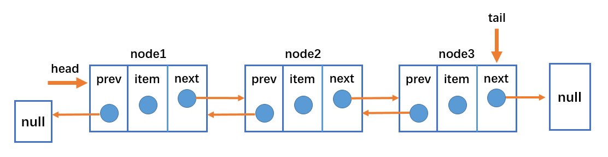
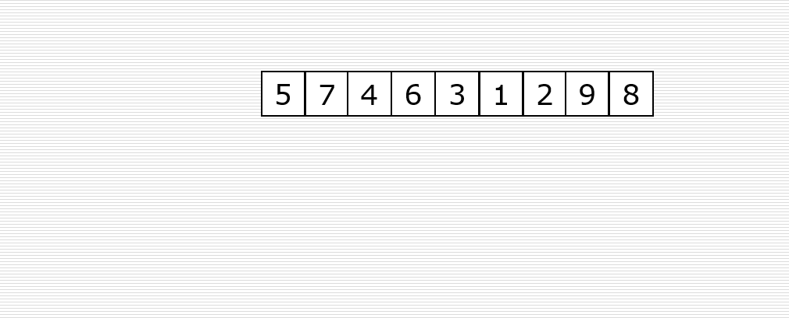

**什么是数据结构？**

数据结构就是在计算机中，存储和组织数据的方式。

**什么是算法？**

算法(Algorithm)的定义

- 一个有限指令集，每条指令的描述不依赖于语言；
- 接收一些输入（有些情况下不需要输入）；
- 产生输入；
- 一定在有限步骤之后终止；

算法通俗理解：解决问题的办法/步骤逻辑。数据结构的实现，离不开算法。

## 栈结构（Stack）

### 简介

数组是一个线性结构，并且可以在数组的**任意位置**插入和删除元素。而**栈和队列**就是比较常见的**受限的线性结构**。如下图所示：


栈的特点为**先进后出，后进先出**（LIFO：last in first out）。

**程序中的栈结构：**

- **函数调用栈：** A（B（C（D（））））：即A函数中调用B，B调用C，C调用D；在A执行的过程中会将A压入栈，随后B执行时B也被压入栈，函数C和D执行时也会被压入栈。所以当前栈的顺序为：A->B->C->D（栈顶）；函数D执行完之后，会弹出栈被释放，弹出栈的顺序为D->C->B->A;
- **递归：** 为什么没有停止条件的递归会造成栈溢出？比如函数A为递归函数，不断地调用自己（因为函数还没有执行完，不会把函数弹出栈），不停地把相同的函数A压入栈，最后造成**栈溢出**（Stack Overfloat）

**练习：** 题目：有6个元素6，5，4，3，2，1按顺序进栈，问下列哪一个不是合法的出栈顺序？

- A：5 4 3 6 1 2 （√）
- B：4 5 3 2 1 6 （√）
- C：3 4 6 5 2 1 （×）
- D：2 3 4 1 5 6 （√）

**栈常见的操作：**

- `push(element)`：添加一个新元素到栈顶位置；
- `pop()`：移除栈顶的元素，同时返回被移除的元素；
- `peek()`：返回栈顶的元素，不对栈做任何修改（该方法不会移除栈顶的元素，仅仅返回它）；
- `isEmpty()`：如果栈里没有任何元素就返回true，否则返回false；
- `size()`：返回栈里的元素个数。这个方法和数组的length属性类似；
- `toString()`：将栈结构的内容以字符串的形式返回。

### 封装栈类

**代码实现：**

```javascript
// 封装栈类
function Stack() {
  // 栈中的属性
  this.items = []

  // 栈的相关操作
  // 1.push():将元素压入栈
  // 方式一(不推荐)：给对象添加方法，其他对象不能复用
  // this.push = () => {
  // }

  // 方式二(推荐)：给Stack类添加方法，能够多对象复用
  Stack.prototype.push = function (element) {
    // 利用数组item的push方法实现Stack类的pop方法
    this.items.push(element)
  }

  // 2.pop():从栈中取出元素
  Stack.prototype.pop = () => {
    // 利用数组item的pop方法实现Stack类的pop方法
    return this.items.pop()
  }

  // 3.peek():查看一下栈顶元素
  Stack.prototype.peek = () => {
    return this.items[this.items.length - 1]
  }

  // 4.isEmpty():判断栈是否为空
  Stack.prototype.isEmpty = () => {
    return this.items.length == 0
  }

  // 5.size():获取栈中元素的个数
  Stack.prototype.size = () => {
    return this.items.length
  }

  // 6.toString():以字符串形式输出栈内数据
  Stack.prototype.toString = () => {
    // 希望输出的形式：20 10 12 8 7
    let resultString = ''
    for (const i of this.items) {
      resultString += `${i} `
    }
    return resultString
  }
}
```

**栈结构的简单应用：**

利用栈结构的特点封装十进至转换为二进至的函数：

```javascript
// 简单应用：
// 封装函数：将十进制转成二进制(十转二的运算最后倒叙取余的特点符合栈'先进后出')
function dec2bin(decNumber) {
  // 1.定义一个栈对象，保存余数
  const stack = new Stack()

  // 2.循环操作
  while (decNumber > 0) {
    // 2.1.获取余数并放入栈中
    stack.push(decNumber % 2)
    // 2.2.获取整除后的结果作为下一次运算的数字(floor:向下取整)
    decNumber = Math.floor(decNumber / 2)
  }

  // 3.从栈中取出0和1
  let binaryString = ''
  const a = stack.items.length
  while (stack.items.length != 0) {
    binaryString += stack.pop()
  }
  return binaryString
}
```

## 队列结构（Queue）

### 简介

队列是是一种受限的线性表，特点为**先进先出**（FIFO：first in first out）。

- 受限之处在于它只允许在表的**前端**（front）进行删除操作；
- 在表的**后端**（rear）进行插入操作；


**队列的应用：**

- 打印队列：计算机打印多个文件的时候，需要排队打印；
- 线程队列：当开启多线程时，当新开启的线程所需的资源不足时就先放入线程队列，等待CPU处理；

**队列类的实现：**

队列的实现和栈一样，有两种方案：

- 基于数组实现；
- 基于链表实现；

**队列的常见操作：**

- `enqueue(element)`：向队列尾部添加一个（或多个）新的项；
- `dequeue()`：移除队列的第一（即排在队列最前面的）项，并返回被移除的元素；
- `front()`：返回队列中的第一个元素——最先被添加，也将是最先被移除的元素。队列不做任何变动（不移除元素，只返回元素信息与Stack类的peek方法非常类似）；
- `isEmpty()`：如果队列中不包含任何元素，返回true，否则返回false；
- `size()`：返回队列包含的元素个数，与数组的length属性类似；
- `toString()`：将队列中的内容，转成字符串形式；

### 封装队列类

#### 代码实现

```javascript
// 基于数组封装队列类
function Queue() {
// 属性
  this.items = []

  // 方法
  // 1.enqueue():将元素加入到队列中
  Queue.prototype.enqueue = (element) => {
    this.items.push(element)
  }

  // 2.dequeue():从队列中删除前端元素
  Queue.prototype.dequeue = () => {
    return this.items.shift()
  }

  // 3.front():查看前端的元素
  Queue.prototype.front = () => {
    return this.items[0]
  }

  // 4.isEmpty:查看队列是否为空
  Queue.prototype.isEmpty = () => {
    return this.items.length == 0
  }

  // 5.size():查看队列中元素的个数
  Queue.prototype.size = () => {
    return this.items.length
  }

  // 6.toString():将队列中元素以字符串形式输出
  Queue.prototype.toString = () => {
    let resultString = ''
    for (const i of this.items) {
      resultString += `${i} `
    }
    return resultString
  }
}
```

#### 队列的应用

使用队列实现小游戏：击鼓传花，传入一组数据和设定的数字num，循环遍历数组内元素，遍历到的元素为指定数字num时将该元素删除，直至数组剩下一个元素。

**代码实现：**

```javascript
// 队列应用：面试题：击鼓传花
function passGame(nameList, num) {
  // 1.创建队列结构
  const queue = new Queue()

  // 2.将所有人依次加入队列
  // 这是ES6的for循环写法，i相当于nameList[i]
  for (const i of nameList) {
    queue.enqueue(i)
  }

  // 3.开始数数
  while (queue.size() > 1) { // 队列中只剩1个人就停止数数
    // 不是num的时候，重新加入队列末尾
    // 是num的时候，将其从队列中删除
    // 3.1.num数字之前的人重新放入队列的末尾(把队列前面删除的加到队列最后)
    for (let i = 0; i < num - 1; i++) {
      queue.enqueue(queue.dequeue())
    }
    // 3.2.num对应这个人，直接从队列中删除
    /*
    思路是这样的，由于队列没有像数组一样的下标值不能直接取到某一元素，所以采用，把num前面的num-1个元素先删除后添加到队列末尾，这样第num个元素就排到了队列的最前面，可以直接使用dequeue方法进行删除
    */
    queue.dequeue()
  }

  // 4.获取剩下的那个人
  const endName = queue.front()
  console.log(`最终剩下的人：${endName}`)

  return nameList.indexOf(endName)
}

// 5.测试击鼓传花
const names = ['lily', 'lucy', 'Tom', 'Lilei', 'Tony']
console.log(passGame(names, 3))
```

### 优先级队列

优先级队列主要考虑的问题为：

- 每个元素不再只是一个数据，还包含数据的优先级；
- 在添加数据过程中，根据优先级放入到正确位置；

#### 优先级队列的实现

**代码实现：**

```javascript
// 封装优先级队列
function PriorityQueue() {
  // 内部类：在类里面再封装一个类;表示带优先级的数据
  function QueueElement(element, priority) {
    this.element = element
    this.priority = priority
  }

  // 封装属性
  this.items = []

  // 1.实现按照优先级插入方法
  PriorityQueue.prototype.enqueue = (element, priority) => {
    // 1.1.创建QueueElement对象
    const queueElement = new QueueElement(element, priority)

    // 1.2.判断队列是否为空
    if (this.items.length == 0) {
      this.items.push(queueElement)
    }
    else {
      // 定义一个变量记录是否成功添加了新元素
      let added = false
      for (const i of this.items) {
        // 让新插入的元素与原有元素进行优先级比较(priority越小，优先级越大)
        if (queueElement.priority < i.priority) {
          this.items.splice(i, 0, queueElement)
          added = true
          // 新元素已经找到插入位置了可以使用break停止循环
          break
        }
      }
      // 新元素没有成功插入，就把它放在队列的最前面
      if (!added) {
        this.items.push(queueElement)
      }
    }
  }

  // 2.dequeue():从队列中删除前端元素
  PriorityQueue.prototype.dequeue = () => {
    return this.items.shift()
  }

  // 3.front():查看前端的元素
  PriorityQueue.prototype.front = () => {
    return this.items[0]
  }

  // 4.isEmpty():查看队列是否为空
  PriorityQueue.prototype.isEmpty = () => {
    return this.items.length == 0
  }

  // 5.size():查看队列中元素的个数
  PriorityQueue.prototype.size = () => {
    return this.items.length
  }

  // 6.toString():以字符串形式输出队列中的元素
  PriorityQueue.prototype.toString = () => {
    let resultString = ''
    for (const i of this.items) {
      resultString += `${i.element}-${i.priority} `
    }
    return resultString
  }
}
```

## 集合结构

### 简介

集合比较常见的实现方式是**哈希表**，这里使用JavaScript的`Object`类进行封装。

集合通常是由一组**无序的、不能重复**的元素构成。

- 数学中常指的集合中的元素是可以重复的，但是计算机中集合的元素不能重复。

**集合是特殊的数组：**

- 特殊之处在于里面的元素**没有顺序，也不能重复。**
- 没有顺序意味着**不能通过下标值进行访问**，不能重复意味着**相同的对象**在集合中只会**存在一份**。

**实现集合类：**

- 在ES6中的`Set`类就是一个集合类，这里我们重新封装一个`Set`类，了解集合的底层实现。

- JavaScript中的`Object`类中的`key`就是一个集合，可以使用它来封装集合类`Set`。

**集合常见的操作：**

- `add(value)`：向集合添加一个新的项；
- `remove(value)`：从集合中移除一个值；
- `has(value)`：如果值在集合中，返回`true`，否则返回`false`；
- `clear()`：移除集合中的所有项；
- `size()`：返回集合所包含元素的数量，与数组的`length`属性相似；
- `value()`：返回一个包含集合中所有值的数组；

还有其他的方法，用的不多这里不做封装；

### 代码实现

```javascript
// 封装集合类
function Set() {
  // 属性
  this.items = {}

  // 方法
  // 一.has方法
  Set.prototype.has = (value) => {
    return this.items.hasOwnProperty(value)
  }

  // 二.add方法
  Set.prototype.add = (value) => {
    // 判断集合中是否已经包含该元素
    if (this.has(value)) {
      return false
    }
    // 将元素添加到集合中
    this.items[value] = value // 表示该属性键和值都为value
    return true // 表示添加成功
  }

  // 三.remove方法
  Set.prototype.remove = (value) => {
    // 1.判断集合中是否包含该元素
    if (!this.has(value)) {
      return false
    }

    // 2.将元素从属性中删除
    delete this.items[value]
    return true
  }

  // 四.clear方法
  Set.prototype.clear = () => {
    // 原来的对象没有引用指向，会被自动回收
    this.items = {}
  }

  // 五.size方法
  Set.prototype.size = () => {
    return Object.keys(this.items).length
  }

  // 获取集合中所有的值
  // 六.values方法
  Set.prototype.values = function () {
    return Object.keys(this.items)
  }
}

// 测试集合类
// 1.创建Set类对象
const set = new Set()

// 添加元素
// 2.测试add方法
console.log(set.add('a'))
console.log(set.add('a'))
console.log(set.add('b'))
console.log(set.add('c'))
console.log(set.add('d'))

// 3.测试values方法
console.log(set.values())

// 删除元素
// 4.测试remove方法
console.log(set.remove('a'))
console.log(set.remove('a'))
console.log(set.values())

// 5.测试has方法
console.log(set.has('b'))

// 6.测试size方法和clear方法
console.log(set.size())
set.clear()
// 由于clear方法的实现原理为指向另外一个空对象，所以不影响原来的对象
console.log(set.size())
console.log(set.values())
```

#### 并集的实现：

```javascript
Set.prototype.union = (otherSet) => {
  // this:集合对象A
  // otherSet:集合对象B
  // 1.创建一个新的集合
  const unionSet = new Set()

  // 2.将A集合中的所有元素添加到新集合中
  let values = this.values()
  // for(let i of values){
  //   unionSet.add(i)
  // }
  for (let i = 0; i < values.length; i++) {
    unionSet.add(values[i])
  }

  // 3.取出B集合中的元素,判断是否需要加到新集合中
  values = otherSet.values()
  // for(let i of values){
  //   //由于集合的add方法已经对重复的元素进行了判断,所以这里可以直接添加
  //   unionSet.add(i)
  // }
  for (let i = 0; i < values.length; i++) {
    unionSet.add(values[i])
  }
  return unionSet
}
```

#### 交集的实现：

```javascript
Set.prototype.intersection = (otherSet) => {
  // this:集合A
  // otherSet:集合B
  // 1.创建新的集合
  const intersectionSet = new Set()

  // 2.从A中取出一个元素，判断是否同时存在于集合B中，是则放入新集合中
  const values = this.values()
  for (let i = 0; i < values.length; i++) {
    const item = values[i]
    if (otherSet.has(item)) {
      intersectionSet.add(item)
    }
  }
  return intersectionSet
}
```

#### 差集的实现：

```javascript
Set.prototype.diffrence = (otherSet) => {
  // this:集合A
  // otherSet:集合B
  // 1.创建新的集合
  const diffrenceSet = new Set()

  // 2.取出A集合中的每一个元素，判断是否同时存在于B中，不存在则添加到新集合中
  const values = this.values()
  for (let i = 0; i < values.length; i++) {
    const item = values[i]
    if (!otherSet.has(item)) {
      diffrenceSet.add(item)
    }
  }
  return diffrenceSet
}
```

#### 子集的实现：

```javascript
Set.prototype.subset = (otherSet) => {
  // this:集合A
  // otherSet：集合B
  // 遍历集合A中的所有元素，如果发现，集合A中的元素，在集合B中不存在，那么放回false，如果遍历完整个集合A没有返回false，就返回true
  const values = this.values()
  for (let i = 0; i < values.length; i++) {
    const item = values[i]
    if (!otherSet.has(item)) {
      return false
    }
  }
  return true
}
```

## 字典结构

### 简介

**字典的特点：**

- 字典存储的是键值对，主要特点是一一对应；
- 比如保存一个人的信息：数组形式：`[19，‘Tom’，1.65]`，可通过下标值取出信息；字典形式：`{"age"：19，"name"："Tom"，"height"：165}`，可以通过`key`取出`value`。
- 此外，在字典中`key`是**不能重复**且**无序**的，而`Value`可以**重复**。

**字典和映射的关系：**

- 有些编程语言中称这种映射关系为**字典**，如`Swift`中的`Dictonary`，`Python`中的`dict`；
- 有些编程语言中称这种映射关系为`Map`，比如`Java`中的`HashMap`&`TreeMap`等；

**字典类常见的操作：**

- `set(key,value)`：向字典中添加新元素。
- `remove(key)`：通过使用键值来从字典中移除键值对应的数据值。
- `has(key)`：如果某个键值存在于这个字典中，则返回`true`，反之则返回`false`。
- `get(key)`：通过键值查找特定的数值并返回。
- `clear()`：将这个字典中的所有元素全部删除。
- `size()`：返回字典所包含元素的数量。与数组的`length`属性类似。
- `keys()`：将字典所包含的所有键名以数组形式返回。
- `values()`：将字典所包含的所有数值以数组形式返回。

### 封装字典

```javascript
// 封装字典类
function Dictionary() {
  // 字典属性
  this.items = {}

  // 字典操作方法
  // 一.在字典中添加键值对
  Dictionary.prototype.set = function (key, value) {
    this.items[key] = value
  }

  // 二.判断字典中是否有某个key
  Dictionary.prototype.has = function (key) {
    return this.items.hasOwnProperty(key)
  }

  // 三.从字典中移除元素
  Dictionary.prototype.remove = function (key) {
    // 1.判断字典中是否有这个key
    if (!this.has(key))
      return false

    // 2.从字典中删除key
    delete this.items[key]
    return true
  }

  // 四.根据key获取value
  Dictionary.prototype.get = function (key) {
    return this.has(key) ? this.items[key] : undefined
  }

  // 五.获取所有keys
  Dictionary.prototype.keys = function () {
    return Object.keys(this.items)
  }

  // 六.size方法
  Dictionary.prototype.keys = function () {
    return this.keys().length
  }

  // 七.clear方法
  Dictionary.prototype.clear = function () {
    this.items = {}
  }
}
```

## 单向链表

### 简介

链表和数组一样，可以用于存储一系列的元素，但是链表和数组的实现机制完全不同。链表的每个元素由一个**存储元素本身的节点**和一个**指向下一个元素的引用**（有的语言称为指针或连接）组成。类似于火车头，一节车厢载着乘客（数据），通过节点连接另一节车厢。


- head属性指向链表的第一个节点；
- 链表中的最后一个节点指向null；
- 当链表中一个节点也没有的时候，head直接指向null；

**数组存在的缺点：**

- 数组的创建通常需要申请一段连续的内存空间（一整块内存），并且大小是固定的。所以当原数组不能满足容量需求时，需要扩容（一般情况下是申请一个更大的数组，比如2倍，然后将原数组中的元素复制过去）。
- 在数组的开头或中间位置插入数据的成本很高，需要进行大量元素的位移。

**链表的优势：**

- 链表中的元素在内存中不必是连续的空间，可以充分利用计算机的内存，实现灵活的内存动态管理。
- 链表不必在创建时就确定大小，并且大小可以无限地延伸下去。
- 链表在插入和删除数据时，时间复杂度可以达到O(1)，相对数组效率高很多。

**链表的缺点：**

- 链表访问任何一个位置的元素时，都需要从头开始访问（无法跳过第一个元素访问任何一个元素）。
- 无法通过下标值直接访问元素，需要从头开始一个个访问，直到找到对应的元素。
- 虽然可以轻松地到达下一个节点，但是回到前一个节点是很难的。

**链表中的常见操作：**

- `append(element)`：向链表尾部添加一个新的项；
- `insert(position，element)`：向链表的特定位置插入一个新的项；
- `get(position)`：获取对应位置的元素；
- `indexOf(element)`：返回元素在链表中的索引。如果链表中没有该元素就返回-1；
- `update(position，element)`：修改某个位置的元素；
- `removeAt(position)`：从链表的特定位置移除一项；
- `remove(element)`：从链表中移除一项；
- `isEmpty()`：如果链表中不包含任何元素，返回trun，如果链表长度大于0则返回false；
- `size()`：返回链表包含的元素个数，与数组的length属性类似；
- `toString()`：由于链表项使用了Node类，就需要重写继承自JavaScript对象默认的toString方法，让其只输出元素的值；

### 代码实现：

```javascript
// 封装链表类
function LinkList() {
  // 封装一个内部类：节点类
  function Node(data) {
    this.data = data
    this.next = null
  }

  // 属性
  // 属性head指向链表的第一个节点
  this.head = null
  this.length = 0

  // 一.实现append方法
  LinkList.prototype.append = (data) => {
    // 1.创建新节点
    const newNode = new Node(data)

    // 2.添加新节点
    // 情况1：只有一个节点时候
    if (this.length == 0) {
      this.head = newNode
      // 情况2：节点数大于1，在链表的最后添加新节点
    }
    else {
      // 让变量current指向第一个节点
      let current = this.head
      // 当current.next(下一个节点不为空)不为空时，一直循环，直到current指向最后一个节点
      while (current.next) {
        current = current.next
      }
      // 最后节点的next指向新的节点
      current.next = newNode
    }
    // 3.添加完新结点之后length+1
    this.length += 1
  }

  // 二.实现toString方法
  LinkList.prototype.toString = () => {
    // 1.定义变量
    let current = this.head
    let listString = ''

    // 2.循环获取一个个的节点
    while (current) {
      listString += `${current.data} `
      current = current.next// 千万不要忘了拼接完一个节点数据之后，让current指向下一个节点
    }
    return listString
  }

  // 三.实现insert方法
  LinkList.prototype.insert = (position, data) => {
    // 理解positon的含义：position=0表示新界点插入后要成为第1个节点，position=2表示新界点插入后要成为第3个节点
    // 1.对position进行越界判断:要求传入的position不能是负数且不能超过LinkList的length
    if (position < 0 || position > this.length) {
      return false
    }
    // 2.根据data创建newNode
    const newNode = new Node(data)

    // 3.插入新节点
    // 情况1：插入位置position=0
    if (position == 0) {
      // 让新节点指向第一个节点
      newNode.next = this.head
      // 让head指向新节点
      this.head = newNode
      // 情况2：插入位置position>0(该情况包含position=length)
    }
    else {
      let index = 0
      let previous = null
      let current = this.head
      // 步骤1：通过while循环使变量current指向position位置的后一个节点(注意while循环的写法)
      while (index++ < position) {
        // 步骤2：在current指向下一个节点之前，让previous指向current当前指向的节点
        previous = current
        current = current.next
      }
      // 步骤3：通过变量current(此时current已经指向position位置的后一个节点)，使newNode指向position位置的后一个节点
      newNode.next = current
      // 步骤4：通过变量previous，使position位置的前一个节点指向newNode
      previous.next = newNode

      // 我们无法直接操作链表中的节点，但是可以通过变量指向这些节点，以此间接地操作节点；
    }
    // 4.新节点插入后要length+1
    this.length += 1

    return true
  }

  // 四.实现get方法
  LinkList.prototype.get = (position) => {
    // 1.越界判断
    // 当position = length时，取到的是null所以0 =< position < length
    if (position < 0 || position >= this.length) {
      return null
    }
    // 2.获取指定的positon位置的后一个节点的data
    // 同样使用一个变量间接操作节点
    let current = this.head
    let index = 0
    while (index++ < position) {
      current = current.next
    }
    return current.data
  }

  // 五.实现indexOf方法
  LinkList.prototype.indexOf = (data) => {
    // 1.定义变量
    let current = this.head
    let index = 0

    // 2.开始查找:只要current不指向null就一直循环
    while (current) {
      if (current.data == data) {
        return index
      }
      current = current.next
      index += 1
    }

    // 3.遍历完链表没有找到，返回-1
    return -1
  }

  // 六.实现update方法
  LinkList.prototype.update = (position, newData) => {
    // 1.越界判断
    // 因为被修改的节点不能为null，所以position不能等于length
    if (position < 0 || position >= this.length) {
      return false
    }
    // 2.查找正确的节点
    let current = this.head
    let index = 0
    while (index++ < position) {
      current = current.next
    }
    // 3.将position位置的后一个节点的data修改成newData
    current.data = newData
    // 返回true表示修改成功
    return true
  }

  // 七.实现removeAt方法
  LinkList.prototype.removeAt = (position) => {
    // 1.越界判断
    if (position < 0 || position >= this.length) {
      return null
    }
    // 2.删除元素
    // 情况1：position = 0时(删除第一个节点)
    let current = this.head
    if (position == 0) {
      // 情况2：position > 0时
      this.head = this.head.next
    }
    else {
      let index = 0
      let previous = null
      while (index++ < position) {
        previous = current
        current = current.next
      }
      // 循环结束后，current指向position后一个节点，previous指向current前一个节点
      // 再使前一个节点的next指向current的next即可
      previous.next = current.next
    }
    // 3，length-1
    this.length -= 1

    // 返回被删除节点的data，为此current定义在最上面
    return current.data
  }

  /* -------------其他方法的实现-------------- */
  // 八.实现remove方法
  LinkList.prototype.remove = (data) => {
    // 1.获取data在列表中的位置
    const position = this.indexOf(data)
    // 2.根据位置信息，删除结点
    return this.removeAt(position)
  }

  // 九.实现isEmpty方法
  LinkList.prototype.isEmpty = () => {
    return this.length == 0
  }

  // 十.实现size方法
  LinkList.prototype.size = () => {
    return this.length
  }
}
```

## 双向链表

### 简介

**双向链表**：既可以从头遍历到尾，又可以从尾遍历到头。也就是说链表连接的过程是双向的，它的实现原理是：一个节点既有向前连接的引用，也有一个向后连接的引用。

**双向链表的缺点：**

- 每次在插入或删除某个节点时，都需要处理四个引用，而不是两个，实现起来会困难些；
- 相对于单向链表，所占内存空间更大一些；
- 但是，相对于双向链表的便利性而言，这些缺点微不足道。

**双向链表的结构：**



- 双向链表不仅有head指针指向第一个节点，而且有tail指针指向最后一个节点；
- 每一个节点由三部分组成：item储存数据、prev指向前一个节点、next指向后一个节点；
- 双向链表的第一个节点的prev指向null；
- 双向链表的最后一个节点的next指向null；

**双向链表常见的操作（方法）：**

- `append(element)`：向链表尾部添加一个新的项；
- `inset(position,element)`：向链表的特定位置插入一个新的项；
- `get(position)`：获取对应位置的元素；
- `indexOf(element)`：返回元素在链表中的索引，如果链表中没有元素就返回-1；
- `update(position,element)`：修改某个位置的元素；
- `removeAt(position)`：从链表的特定位置移除一项；
- `isEmpty()`：如果链表中不包含任何元素，返回trun，如果链表长度大于0则返回false；
- `size()`：返回链表包含的元素个数，与数组的length属性类似；
- `toString()`：由于链表项使用了Node类，就需要重写继承自JavaScript对象默认的toString方法，让其只输出元素的值；
- `forwardString()`：返回正向遍历节点字符串形式；
- `backwordString()`：返回反向遍历的节点的字符串形式；

### 代码实现：

```javascript
// 封装双向链表
function DoubleLinklist() {
  // 封装内部类：节点类
  function Node(data) {
    this.data = data
    this.prev = null
    this.next = null
  }

  // 属性
  this.head = null
  this.tail == null
  this.length = 0

  // 常见的操作：方法
  // 一.append方法
  DoubleLinklist.prototype.append = (data) => {
    // 1.根据data创建新节点
    const newNode = new Node(data)

    // 2.添加节点
    // 情况1：添加的是第一个节点
    if (this.length == 0) {
      this.tail = newNode
      this.head = newNode
    // 情况2：添加的不是第一个节点
    }
    else {
      newNode.prev = this.tail
      this.tail.next = newNode
      this.tail = newNode
    }

    // 3.length+1
    this.length += 1
  }

  // 二.将链表转变为字符串形式
  // 2.1.toString方法
  DoubleLinklist.prototype.toString = () => {
    return this.backwardString()
  }

  // 2.2.forwardString方法
  DoubleLinklist.prototype.forwardString = () => {
    // 1.定义变量
    let current = this.tail
    let resultString = ''

    // 2.依次向前遍历，获取每一个节点
    while (current) {
      resultString += `${current.data}--`
      current = current.prev
    }
    return resultString
  }

  // 2.3.backwardString方法
  DoubleLinklist.prototype.backwardString = () => {
    // 1.定义变量
    let current = this.head
    let resultString = ''

    // 2.依次向后遍历，获取每一个节点
    while (current) {
      resultString += `${current.data}--`
      current = current.next
    }
    return resultString
  }

  // 三.insert方法
  DoubleLinklist.prototype.insert = (position, data) => {
    // 1.越界判断
    if (position < 0 || position > this.length)
      return false

    // 2.根据data创建新的节点
    const newNode = new Node(data)

    // 3.插入新节点
    // 原链表为空
    // 情况1：插入的newNode是第一个节点
    if (this.length == 0) {
      this.head = newNode
      this.tail = newNode
    // 原链表不为空
    }
    else {
      // 情况2：position == 0
      if (position == 0) {
        this.head.prev = newNode
        newNode.next = this.head
        this.head = newNode
      // 情况3：position == this.length
      }
      else if (position == this.length) {
        this.tail.next = newNode
        newNode.prev = this.tail
        this.tail = newNode
        // 情况4：0 < position < this.length
      }
      else {
        let current = this.head
        let index = 0
        while (index++ < position) {
          current = current.next
        }
        // 修改pos位置前后节点变量的指向
        newNode.next = current
        newNode.prev = current.prev
        current.prev.next = newNode
        current.prev = newNode
      }
    }
    // 4.length+1
    this.length += 1
    return true// 返回true表示插入成功
  }

  // 四.get方法
  DoubleLinklist.prototype.get = (position) => {
    // 1.越界判断
    if (position < 0 || position >= this.length) { // 获取元素时position不能等于length
      return null
    }

    // 2.获取元素
    let current = null
    let index = 0
    // this.length / 2 > position:从头开始遍历
    if ((this.length / 2) > position) {
      current = this.head
      while (index++ < position) {
        current = current.next
      }
    // this.length / 2 =< position:从尾开始遍历
    }
    else {
      current = this.tail
      index = this.length - 1
      while (index-- > position) {
        current = current.prev
      }
    }
    return current.data
  }

  // 五.indexOf方法
  DoubleLinklist.prototype.indexOf = (data) => {
    // 1.定义变量
    let current = this.head
    let index = 0

    // 2.遍历链表，查找与data相同的节点
    while (current) {
      if (current.data == data) {
        return index
      }
      current = current.next
      index += 1
    }
    return -1
  }

  // 六.update方法
  DoubleLinklist.prototype.update = (position, newData) => {
    // 1.越界判断
    if (position < 0 || position >= this.length) {
      return false
    }

    // 2.寻找正确的节点
    let current = this.head
    let index = 0
    // this.length / 2 > position:从头开始遍历
    if (this.length / 2 > position) {
      while (index++ < position) {
        current = current.next
      }
    // this.length / 2 =< position:从尾开始遍历
    }
    else {
      current = this.tail
      index = this.length - 1
      while (index-- > position) {
        current = current.prev
      }
    }

    // 3.修改找到节点的data
    current.data = newData
    return true// 表示成功修改
  }

  // 七.removeAt方法
  DoubleLinklist.prototype.removeAt = (position) => {
    // 1.越界判断
    if (position < 0 || position >= this.length) {
      return null
    }

    // 2.删除节点
    // 当链表中length == 1
    // 情况1：链表只有一个节点
    let current = this.head// 定义在最上面方便以下各种情况返回current.data
    if (this.length == 1) {
      this.head = null
      this.tail = null
    // 当链表中length > 1
    }
    else {
      // 情况2：删除第一个节点
      if (position == 0) {
        this.head.next.prev = null
        this.head = this.head.next
      // 情况3：删除最后一个节点
      }
      else if (position == this.length - 1) {
        current = this.tail// 该情况下返回被删除的最后一个节点
        this.tail.prev.next = null
        this.tail = this.tail.prev
      }
      else {
      // 情况4：删除链表中间的节点
        let index = 0
        while (index++ < position) {
          current = current.next
        }
        current.next.prev = current.prev
        current.prev.next = current.next
      }
    }

    // 3.length -= 1
    this.length -= 1
    return current.data// 返回被删除节点的数据
  }
  /* --------------------其他方法------------------- */
  // 八.remove方法
  DoubleLinklist.prototype.remove = (data) => {
    // 1.根据data获取下标值
    const index = this.indexOf(data)

    // 2.根据index删除对应位置的节点
    return this.removeAt(index)
  }

  // 九.isEmpty方法
  DoubleLinklist.prototype.isEmpty = () => {
    return this.length == 0
  }

  // 十.size方法
  DoubleLinklist.prototype.size = () => {
    return this.length
  }

  // 十一.getHead方法：获取链表的第一个元素
  DoubleLinklist.prototype.getHead = () => {
    return this.head.data
  }

  // 十二.getTail方法：获取链表的最后一个元素
  DoubleLinklist.prototype.getTail = () => {
    return this.tail.data
  }
}
```

## 哈希表

### 简介

#### 认识哈希表

哈希表通常是基于数组实现的，但是相对于数组，它存在更多优势：

- 哈希表可以提供非常快速的**插入-删除-查找操作**；
- 无论多少数据，插入和删除值都只需要非常短的时间，即O(1)的时间级。实际上，只需要几个机器指令即可完成；
-  哈希表的速度比树还要快，基本可以瞬间查找到想要的元素。但是相对于树来说编码要简单得多。

**哈希表同样存在不足之处：**
- 哈希表中的数据是**没有顺序**的，所以不能以一种固定的方式（比如从小到大 ）来遍历其中的元素。
- 通常情况下，哈希表中的key是**不允许重复**的，不能放置相同的key，用于保存不同的元素。

**哈希表是什么？**
- 哈希表并不好理解，不像数组、链表和树等可通过图形的形式表示其结构和原理。
- 哈希表的结构就是数组，但它神奇之处在于对下标值的一种变换，这种变换我们可以称之为哈希函数，通过哈希函数可以获取`HashCode`。

哈希表最后还是基于数据来实现的，只不过哈希表能够通过哈希函数把字符串转化为对应的下标值，建立字符串和下标值的对应关系。

#### 哈希化的方式

为了把字符串转化为对应的下标值，需要有一套编码系统，为了方便理解我们创建这样一套编码系统：比如a为1，b为2，c为3，以此类推z为26，空格为27（不考虑大写情况）。

有了编码系统后，将字母转化为数字也有很多种方式：

- 方式一：数字相加。例如cats转化为数字：3+1+20+19=43，那么就把43作为cats单词的下标值储存在数组中；

但是这种方式会存在这样的问题：很多的单词按照该方式转化为数字后都是43，比如was。而在数组中一个下标值只能储存一个数据，所以该方式不合理。

- 方式二：幂的连乘。我们平时使用的大于10的数字，就是用幂的连乘来表示它的唯一性的。比如： 6543=6 * 103 + 5 * 102 + 4 * 10 + 3；这样单词也可以用该种方式来表示：cats = 3 * 273 + 1 * 272 + 20 * 27 + 17 =60337;

虽然该方式可以保证字符的唯一性，但是如果是较长的字符（如aaaaaaaaaa）所表示的数字就非常大，此时要求很大容量的数组，然而其中却有许多下标值指向的是无效的数据（比如不存在zxcvvv这样的单词），造成了数组空间的浪费。

**两种方案总结：**

- 第一种方案（让数字相加求和）产生的数组下标太少；
- 第二种方案（与27的幂相乘求和）产生的数组下标又太多；

现在需要一种压缩方法，把幂的连乘方案系统中得到的巨大整数范围压缩到可接受的数组范围中。可以通过取余操作来实现。虽然取余操作得到的结构也有可能重复，但是可以通过其他方式解决。

哈希表的一些概念：

- 哈希化：将大数字转化成数组范围内下标的过程，称之为哈希化；
- 哈希函数：我们通常会将单词转化成大数字，把大数字进行哈希化的代码实现放在一个函数中，该函数就称为哈希函数；
- 哈希表：对最终数据插入的数组进行整个结构的封装，得到的就是哈希表。

仍然需要解决的问题：

- 哈希化过后的下标依然可能重复，如何解决这个问题呢？这种情况称为冲突，冲突是不可避免的，我们只能解决冲突。

#### 解决冲突常见的两种方案：

- 方案一：链地址法（拉链法）；

如下图所示，我们将每一个数字都对10进行取余操作，则余数的范围0~9作为数组的下标值。并且，数组每一个下标值对应的位置存储的不再是一个数字了，而是存储由经过取余操作后得到相同余数的数字组成的数组或链表。


这样可以根据下标值获取到整个数组或链表，之后继续在数组或链表中查找就可以了。而且，产生冲突的元素一般不会太多。

总结：链地址法解决冲突的办法是每个数组单元中存储的不再是单个数据，而是一条链条，这条链条常使用的数据结构为数组或链表，两种数据结构查找的效率相当（因为链条的元素一般不会太多）。

- 方案二：开放地址法；

开放地址法的主要工作方式是寻找空白的单元格来放置冲突的数据项。


根据探测空白单元格位置方式的不同，可分为三种方法：

- 线性探测
- 二次探测
- 再哈希法

#### 寻找空白单元格的方式

线性探测

当插入13时：

- 经过哈希化（对10取余）之后得到的下标值index=3，但是该位置已经放置了数据33。而线性探测就是从index位置+1开始向后一个一个来查找合适的位置来放置13，所谓合适的位置指的是空的位置，如上图中index=4的位置就是合适的位置。

当查询13时：

- 首先13经过哈希化得到index=3，如果index=3的位置存放的数据与需要查询的数据13相同，就直接返回；
- 不相同时，则线性查找，从index+1位置开始一个一个位置地查找数据13；
- 查询过程中不会遍历整个哈希表，只要查询到空位置，就停止，因为插入13时不会跳过空位置去插入其他位置。

当删除13时：

- 删除操作和上述两种情况类似，但需要注意的是，删除一个数据项时，不能将该位置下标的内容设置为null，否则会影响到之后其他的查询操作，因为一遇到为null的位置就会停止查找。
- 通常删除一个位置的数据项时，我们可以将它进行特殊处理（比如设置为-1），这样在查找时遇到-1就知道要继续查找。

线性探测存在的问题：

- 线性探测存在一个比较严重的问题，就是聚集；
- 如哈希表中还没插入任何元素时，插入23、24、25、26、27，这就意味着下标值为3、4、5、6、7的位置都放置了数据，这种一连串填充单元就称为聚集；
- 聚集会影响哈希表的性能，无论是插入/查询/删除都会影响；
- 比如插入13时就会发现，连续的单元3~7都不允许插入数据，并且在插入的过程中需要经历多次这种情况。二次探测法可以解决该问题。


二次探测

上文所说的线性探测存在的问题：

- 如果之前的数据是连续插入的，那么新插入的一个数据可能需要探测很长的距离；

二次探测是在线性探测的基础上进行了优化：

- 线性探测：我们可以看成是步长为1的探测，比如从下表值x开始，那么线性探测就是按照下标值：x+1、x+2、x+3等依次探测；

- 二次探测：对步长进行了优化，比如从下标值x开始探测：x+12、x+22、x+33 。这样一次性探测比较长的距离，避免了数据聚集带来的影响。

二次探测存在的问题：

- 当插入数据分布性较大的一组数据时，比如：13-163-63-3-213，这种情况会造成步长不一的一种聚集（虽然这种情况出现的概率较线性探测的聚集要小），同样会影响性能。

再哈希化

在开放地址法中寻找空白单元格的最好的解决方式为再哈希化：

- 二次探测的步长是固定的：1，4，9，16依次类推；
- 现在需要一种方法：产生一种依赖关键字(数据)的探测序列，而不是每个关键字探测步长都一样；
- 这样，不同的关键字即使映射到相同的数组下标，也可以使用不同的探测序列；
- 再哈希法的做法为：把关键字用另一个哈希函数，再做一次哈希化，用这次哈希化的结果作为该关键字的步长；

第二次哈希化需要满足以下两点：

- 和第一个哈希函数不同，不然哈希化后的结果仍是原来位置；
- 不能输出为0，否则每次探测都是原地踏步的死循环；

优秀的哈希函数：

- stepSize = constant - （key % constant）；
- 其中constant是质数，且小于数组的容量；
- 例如：stepSize = 5 - （key % 5），满足需求，并且结果不可能为0；

哈希化的效率

哈希表中执行插入和搜索操作效率是非常高的。

- 如果没有发生冲突，那么效率就会更高；
- 如果发生冲突，存取时间就依赖后来的探测长度；
- 平均探测长度以及平均存取时间，取决于填装因子，随着填装因子变大，探测长度会越来越长。

理解概念装填因子：

- 装填因子表示当前哈希表中已经包含的数据项和整个哈希表长度的比值；
- 装填因子 = 总数据项 / 哈希表长度；
- 开放地址法的装填因子最大为1，因为只有空白的单元才能放入元素；
- 链地址法的装填因子可以大于1，因为只要愿意，拉链法可以无限延伸下去；

#### 不同探测方式性能的比较

线性探测：

可以看到，随着装填因子的增大，平均探测长度呈指数形式增长，性能较差。实际情况中，最好的装填因子取决于存储效率和速度之间的平衡，随着装填因子变小，存储效率下降，而速度上升。


二次探测和再哈希化的性能：

二次探测和再哈希法性能相当，它们的性能比线性探测略好。由下图可知，随着装填因子的变大，平均探测长度呈指数形式增长，需要探测的次数也呈指数形式增长，性能不高。

链地址法的性能：

可以看到随着装填因子的增加，平均探测长度呈线性增长，较为平缓。在开发中使用链地址法较多，比如Java中的HashMap中使用的就是链地址法。

#### 优秀的哈希函数

哈希表的优势在于它的速度，所以哈希函数不能采用消耗性能较高的复杂算法。提高速度的一个方法是在哈希函数中尽量减少乘法和除法。

性能高的哈希函数应具备以下两个优点：

- 快速的计算；
- 均匀的分布；

快速计算

霍纳法则：在中国霍纳法则也叫做秦久韶算法，具体算法为：


求多项式的值时，首先计算最内层括号内一次多项式的值，然后由内向外逐层计算一次多项式的值。这种算法把求n次多项式f(x)的值就转化为求n个一次多项式的值。

变换之前：

- 乘法次数：n（n+1）/2次；
- 加法次数：n次；

变换之后：

- 乘法次数：n次；
- 加法次数：n次；

如果使用大O表示时间复杂度的话，直接从变换前的O(N2)降到了O(N)。

均匀分布

为了保证数据在哈希表中均匀分布，当我们需要使用常量的地方，尽量使用质数；比如：哈希表的长度、N次幂的底数等。

Java中的HashMap采用的是链地址法，哈希化采用的是公式为：`index = HashCode（key）&（Length-1）`

即将数据化为二进制进行与运算，而不是取余运算。这样计算机直接运算二进制数据，效率更高。但是JavaScript在进行叫大数据的与运算时会出现问题，所以以下使用JavaScript实现哈希化时还是采用取余运算。

### 初步封装哈希表

哈希表的常见操作为：

- `put(key，value)`：插入或修改操作；
- `get(key)`：获取哈希表中特定位置的元素；
- `remove(key)`：删除哈希表中特定位置的元素；
- `isEmpty()`：如果哈希表中不包含任何元素，返回true，如果哈希表长度大于0则返回false；
- `size()`：返回哈希表包含的元素个数；
- `resize(value)`：对哈希表进行扩容操作；

#### 哈希函数的简单实现

首先使用霍纳法则计算hashCode的值，通过取余操作实现哈希化，此处先简单地指定数组的大小。

```javascript
// 设计哈希函数
// 1.将字符串转成比较大的数字：hashCede
// 2.将大的数字hasCode压缩到数组范围(大小)之内
function hashFunc(str, size) {
  // 1.定义hashCode变量
  let hashCode = 0

  // 2.霍纳法则，计算hashCode的值
  // cats -> Unicode编码
  for (let i = 0; i < str.length; i++) {
    // str.charCodeAt(i)//获取某个字符对应的unicode编码
    hashCode = 37 * hashCode + str.charCodeAt(i)
  }

  // 3.取余操作
  const index = hashCode % size
  return index
}
```

#### 创建哈希表

封装哈希表的数组结构模型：


首先创建哈希表类HashTable，并添加必要的属性和上面实现的哈希函数，再进行其他方法的实现。

```javascript
//封装哈希表类
function HashTable() {
  //属性
  this.storage = []
  this.count = 0//计算已经存储的元素个数
  //装填因子：loadFactor > 0.75时需要扩容；loadFactor < 0.25时需要减少容量
  this.limit = 7//初始长度

  //方法
  //哈希函数
  HashTable.prototype.hashFunc = function(str, size){
  //1.定义hashCode变量
  let hashCode = 0

  //2.霍纳法则，计算hashCode的值
  //cats -> Unicode编码
  for(let i = 0 ;i < str.length; i++){
    // str.charCodeAt(i)//获取某个字符对应的unicode编码
    hashCode = 37 * hashCode + str.charCodeAt(i)
  }

  //3.取余操作
  let index = hashCode % size
  return index
}
```

#### put(key,value)

哈希表的插入和修改操作是同一个函数：因为，当使用者传入一个`<key，value>`时，如果原来不存在该key，那么就是插入操作，如果原来已经存在该key，那么就是修改操作。


实现思路：

- 首先，根据key获取索引值index，目的为将数据插入到storage的对应位置；
- 然后，根据索引值取出bucket，如果bucket不存在，先创建bucket，随后放置在该索引值的位置；
- 接着，判断新增还是修改原来的值。如果已经有值了，就修改该值；如果没有，就执行后续操作。
- 最后，进行新增数据操作。

代码实现：

```javascript
// 插入&修改操作
HashTable.prototype.put = function (key, value) {
  // 1.根据key获取对应的index
  const index = this.hashFunc(key, this.limit)

  // 2.根据index取出对应的bucket
  let bucket = this.storage[index]

  // 3.判断该bucket是否为null
  if (bucket == null) {
    bucket = []
    this.storage[index] = bucket
  }

  // 4.判断是否是修改数据
  for (let i = 0; i < bucket.length; i++) {
    const tuple = bucket[i]
    if (tuple[0] == key) {
      tuple[1] = value
      return// 不用返回值
    }
  }

  // 5.进行添加操作
  bucket.push([key, value])
  this.count += 1
}
```

#### get(key)

实现思路：

- 首先，根据key通过哈希函数获取它在storage中对应的索引值index；
- 然后，根据索引值获取对应的bucket；
- 接着，判断获取到的bucket是否为null，如果为null，直接返回null；
- 随后，线性遍历bucket中每一个key是否等于传入的key。如果等于，直接返回对应的value；
- 最后，遍历完bucket后，仍然没有找到对应的key，直接return null即可。

```javascript
// 获取操作
HashTable.prototype.get = function (key) {
  // 1.根据key获取对应的index
  const index = this.hashFunc(key, this.limit)

  // 2.根据index获取对应的bucket
  const bucket = this.storage[index]

  // 3.判断bucket是否等于null
  if (bucket == null) {
    return null
  }

  // 4.有bucket，那么就进行线性查找
  for (let i = 0; i < bucket.length; i++) {
    const tuple = bucket[i]
    if (tuple[0] == key) { // tuple[0]存储key，tuple[1]存储value
      return tuple[1]
    }
  }

  // 5.依然没有找到，那么返回null
  return null
}
```

#### remove(key)

实现思路：

- 首先，根据key通过哈希函数获取它在storage中对应的索引值index；
- 然后，根据索引值获取对应的bucket；
- 接着，判断获取到的bucket是否为null，如果为null，直接返回null；
- 随后，线性查找bucket，寻找对应的数据，并且删除；
- 最后，依然没有找到，返回null；

代码实现：

```javascript
// 删除操作
HashTable.prototype.remove = function (key) {
  // 1.根据key获取对应的index
  const index = this.hashFunc(key, this.limit)

  // 2.根据index获取对应的bucket
  const bucket = this.storage[index]

  // 3.判断bucket是否为null
  if (bucket == null) {
    return null
  }

  // 4.有bucket,那么就进行线性查找并删除
  for (let i = 0; i < bucket.length; i++) {
    const tuple = bucket[i]
    if (tuple[0] == key) {
      bucket.splice(i, 1)
      this.count -= 1
      return tuple[1]
    }
  }

  // 5.依然没有找到，返回null
  return null
}
```

#### 其他方法的实现

其他方法包括：`isEmpty()`、`size()`：

```javascript
// 判断哈希表是否为null
HashTable.prototype.isEmpty = function () {
  return this.count == 0
}

// 获取哈希表中元素的个数
HashTable.prototype.size = function () {
  return this.count
}
```

### 哈希表的扩容

#### 扩容与压缩

为什么需要扩容？

- 前面我们在哈希表中使用的是长度为7的数组，由于使用的是链地址法，装填因子(loadFactor)可以大于1，所以这个哈希表可以无限制地插入新数据。
- 但是，随着数据量的增多，storage中每一个index对应的bucket数组（链表）就会越来越长，这就会造成哈希表效率的降低

什么情况下需要扩容？

- 常见的情况是loadFactor > 0.75的时候进行扩容；

如何进行扩容？

- 简单的扩容可以直接扩大两倍（关于质数，之后讨论）；
- 扩容之后所有的数据项都要进行同步修改；

实现思路：

- 首先，定义一个变量，比如oldStorage指向原来的storage；
- 然后，创建一个新的容量更大的数组，让this.storage指向它；
- 最后，将oldStorage中的每一个bucket中的每一个数据取出来依次添加到this.storage指向的新数组中；


代码实现：

```javascript
// 哈希表扩容
HashTable.prototype.resize = function (newLimit) {
  // 1.保存旧的storage数组内容
  const oldStorage = this.storage

  // 2.重置所有的属性
  this.storage = []
  this.count = 0
  this.limit = newLimit

  // 3.遍历oldStorage中所有的bucket
  for (let i = 0; i < oldStorage.length; i++) {
    // 3.1.取出对应的bucket
    const bucket = oldStorage[i]

    // 3.2.判断bucket是否为null
    if (bucket == null) {
      continue
    }

    // 3.3.bucket中有数据，就取出数据重新插入
    for (let j = 0; j < bucket.length; j++) {
      const tuple = bucket[j]
      this.put(tuple[0], tuple[1])// 插入数据的key和value
    }
  }
}
```

上述定义的哈希表的resize方法，既可以实现哈希表的扩容，也可以实现哈希表容量的压缩。

> 装填因子 = 哈希表中数据 / 哈希表长度，即 loadFactor = count / HashTable.length。

- 通常情况下当装填因子laodFactor > 0.75时，对哈希表进行扩容。在哈希表中的添加方法（push方法）中添加如下代码，判断是否需要调用扩容函数进行扩容：

```javascript
// 判断是否需要扩容操作
if (this.count > this.limit * 0.75) {
  this.resize(this.limit * 2)
}
```

- 当装填因子laodFactor < 0.25时，对哈希表容量进行压缩。在哈希表中的删除方法（remove方法）中添加如下代码，判断是否需要调用扩容函数进行压缩：

```javascript
// 缩小容量
if (this.limit > 7 && this.count < this.limit * 0.25) {
  this.resize(Math.floor(this.limit / 2))
}
```

#### 选择质数作为容量

针对质数的特点：只能被1和num整除，不能被2 ~ (num-1)整除。遍历2 ~ (num-1) 。

```javascript
function isPrime(num) {
  if (num <= 1) {
    return false
  }
  for (let i = 2; i <= num - 1; i++) {
    if (num % i == 0) {
      return false
    }
  }
  return true
}
```

只需要遍历2 ~ num的平方根即可

```javascript
function isPrime(num) {
  if (num <= 1) {
    return false
  }
  // 1.获取num的平方根:Math.sqrt(num)
  // 2.循环判断
  for (let i = 2; i <= Math.sqrt(num); i++) {
    if (num % i == 0) {
      return false
    }
  }
  return true
}
```

实现扩容后的哈希表容量为质数

实现思路：

2倍扩容之后，通过循环调用isPrime判断得到的容量是否为质数，不是则+1，直到是为止。比如原长度：7，2倍扩容后长度为14，14不是质数，14 + 1 = 15不是质数，15 + 1 = 16不是质数，16 + 1 = 17是质数，停止循环，由此得到质数17

代码实现：

- 第一步：首先需要为HashTable类添加判断质数的isPrime方法和获取质数的getPrime方法：

```javascript
// 判断传入的num是否质数
HashTable.prototype.isPrime = function (num) {
  if (num <= 1) {
    return false
  }
  // 1.获取num的平方根:Math.sqrt(num)
  // 2.循环判断
  for (let i = 2; i <= Math.sqrt(num); i++) {
    if (num % i == 0) {
      return false
    }
  }
  return true
}

// 获取质数的方法
HashTable.prototype.getPrime = function (num) {
  // 7*2=14,+1=15,+1=16,+1=17(质数)
  while (!this.isPrime(num)) {
    num++
  }
  return num
}
```

- 第二步：修改添加元素的put方法和删除元素的remove方法中关于数组扩容的相关操作：

在put方法中添加如下代码：

```javascript
// 判断是否需要扩容操作
if (this.count > this.limit * 0.75) {
  const newSize = this.limit * 2
  const newPrime = this.getPrime(newSize)
  this.resize(newPrime)
}
```

在remove方法中添加如下代码：

```javascript
// 缩小容量
if (this.limit > 7 && this.count < this.limit * 0.25) {
  const newSize = Math.floor(this.limit / 2)
  const newPrime = this.getPrime(newSize)
  this.resize(newPrime)
}
```

完整代码：

```javascript
// 封装哈希表类
function HashTable() {
  // 属性
  this.storage = []
  this.count = 0// 计算已经存储的元素个数
  // 装填因子：loadFactor > 0.75时需要扩容；loadFactor < 0.25时需要减少容量
  this.limit = 7// 初始长度

  // 方法
  // 哈希函数
  HashTable.prototype.hashFunc = function (str, size) {
    // 1.定义hashCode变量
    let hashCode = 0

    // 2.霍纳法则，计算hashCode的值
    // cats -> Unicode编码
    for (let i = 0; i < str.length; i++) {
      // str.charCodeAt(i)//获取某个字符对应的unicode编码
      hashCode = 37 * hashCode + str.charCodeAt(i)
    }

    // 3.取余操作
    const index = hashCode % size
    return index
  }

  // 一.插入&修改操作
  HashTable.prototype.put = function (key, value) {
    // 1.根据key获取对应的index
    const index = this.hashFunc(key, this.limit)

    // 2.根据index取出对应的bucket
    let bucket = this.storage[index]

    // 3.判断该bucket是否为null
    if (bucket == null) {
      bucket = []
      this.storage[index] = bucket
    }

    // 4.判断是否是修改数据
    for (let i = 0; i < bucket.length; i++) {
      const tuple = bucket[i]
      if (tuple[0] == key) {
        tuple[1] = value
        return// 不用返回值
      }
    }

    // 5.进行添加操作
    bucket.push([key, value])
    this.count += 1

    // 6.判断是否需要扩容操作
    if (this.count > this.limit * 0.75) {
      const newSize = this.limit * 2
      const newPrime = this.getPrime(newSize)
      this.resize(newPrime)
    }
  }

  // 二.获取操作
  HashTable.prototype.get = function (key) {
    // 1.根据key获取对应的index
    const index = this.hashFunc(key, this.limit)

    // 2.根据index获取对应的bucket
    const bucket = this.storage[index]

    // 3.判断bucket是否等于null
    if (bucket == null) {
      return null
    }

    // 4.有bucket，那么就进行线性查找
    for (let i = 0; i < bucket.length; i++) {
      const tuple = bucket[i]
      if (tuple[0] == key) { // tuple[0]存储key，tuple[1]存储value
        return tuple[1]
      }
    }

    // 5.依然没有找到，那么返回null
    return null
  }

  // 三.删除操作
  HashTable.prototype.remove = function (key) {
    // 1.根据key获取对应的index
    const index = this.hashFunc(key, this.limit)

    // 2.根据index获取对应的bucket
    const bucket = this.storage[index]

    // 3.判断bucket是否为null
    if (bucket == null) {
      return null
    }

    // 4.有bucket,那么就进行线性查找并删除
    for (let i = 0; i < bucket.length; i++) {
      const tuple = bucket[i]
      if (tuple[0] == key) {
        bucket.splice(i, 1)
        this.count -= 1
      }
    }

    // 5.依然没有找到，返回null
    return null

    // 6.缩小容量
    if (this.limit > 7 && this.count < this.limit * 0.25) {
      const newSize = Math.floor(this.limit / 2)
      const newPrime = this.getPrime(newSize)
      this.resize(newPrime)
    }
    return tuple[1]
  }

  /* ------------------其他方法-------------------- */
  // 判断哈希表是否为null
  HashTable.prototype.isEmpty = function () {
    return this.count == 0
  }

  // 获取哈希表中元素的个数
  HashTable.prototype.size = function () {
    return this.count
  }

  // 哈希表扩容
  HashTable.prototype.resize = function (newLimit) {
    // 1.保存旧的storage数组内容
    const oldStorage = this.storage

    // 2.重置所有的属性
    this.storage = []
    this.count = 0
    this.limit = newLimit

    // 3.遍历oldStorage中所有的bucket
    for (let i = 0; i < oldStorage.length; i++) {
      // 3.1.取出对应的bucket
      const bucket = oldStorage[i]

      // 3.2.判断bucket是否为null
      if (bucket == null) {
        continue
      }

      // 3.3.bucket中有数据，就取出数据重新插入
      for (let j = 0; j < bucket.length; j++) {
        const tuple = bucket[j]
        this.put(tuple[0], tuple[1])// 插入数据的key和value
      }
    }
  }

  // 判断传入的num是否质数
  HashTable.prototype.isPrime = function (num) {
    if (num <= 1) {
      return false
    }
    // 1.获取num的平方根:Math.sqrt(num)
    // 2.循环判断
    for (let i = 2; i <= Math.sqrt(num); i++) {
      if (num % i == 0) {
        return false
      }
    }
    return true
  }

  // 获取质数的方法
  HashTable.prototype.getPrime = function (num) {
    // 7*2=14,+1=15,+1=16,+1=17(质数)
    while (!this.isPrime(num)) {
      num++
    }
    return num
  }
}
```

## 树

树 是一种经常用到的数据结构，用来模拟具有树状结构性质的数据集合。

树里的每一个节点有一个值和一个包含所有子节点的列表。从图的观点来看，树也可视为一个拥有N 个节点和N-1 条边的一个有向无环图。

二叉树是一种更为典型的树状结构。如它名字所描述的那样，二叉树是每个节点最多有两个子树的树结构，通常子树被称作“左子树”和“右子树”。

### 二叉搜索树的封装

**二叉树搜索树的基本属性：**

如图所示：二叉搜索树有四个最基本的属性：指向节点的根(root)，节点中的键(key)、左指针(right)、右指针(right)。


所以，二叉搜索树中除了定义root属性外，还应定义一个节点内部类，里面包含每个节点中的left、right和key三个属性：

```javascript
// 封装二叉搜索树
function BinarySearchTree() {
  // 节点内部类
  function Node(key) {
    this.key = key
    this.left = null
    this.right = null
  }

  // 属性
  this.root = null
}
```

**二叉搜索树的常见操作：**

- `insert(key)`：向树中插入一个新的键；
- `search(key)`：在树中查找一个键，如果节点存在，则返回true；如果不存在，则返回false；
- `inOrderTraverse`：通过中序遍历方式遍历所有节点；
- `preOrderTraverse`：通过先序遍历方式遍历所有节点；
- `postOrderTraverse`：通过后序遍历方式遍历所有节点；
- `min`：返回树中最小的值/键；
- `max`：返回树中最大的值/键；
- `remove(key)`：从树中移除某个键；
#### 插入数据

**实现思路：**

- 首先根据传入的key创建节点对象；
- 然后判断根节点是否存在，不存在时通过：`this.root = newNode`，直接把新节点作为二叉搜索树的根节点。
- 若存在根节点则重新定义一个内部方法`insertNode()`用于查找插入点。

```javascript
// insert方法:对外向用户暴露的方法
BinarySearchTree.prototype.insert = function (key) {
  // 1.根据key创建节点
  const newNode = new Node(key)

  // 2.判断根节点是否存在
  if (this.root == null) {
    this.root = newNode
    // 根节点存在时
  }
  else {
    this.insertNode(this.root, newNode)
  }
}
```

**内部方法`insertNode()`的实现思路:**

根据比较传入的两个节点，一直查找新节点适合插入的位置，直到成功插入新节点为止。

当`newNode.key < node.key`向左查找:

- 情况1：当node无左子节点时，直接插入：
- 情况2：当node有左子节点时，递归调用insertNode(),直到遇到无左子节点成功插入newNode后，不再符合该情况，也就不再调用insertNode()，递归停止。


当`newNode.key >= node.key`向右查找，与向左查找类似：

- 情况1：当node无右子节点时，直接插入：
- 情况2：当node有右子节点时，依然递归调用insertNode(),直到遇到传入insertNode方法的node无右子节点成功插入newNode为止：


**insertNode()代码实现：**

```javascript
// 内部使用的insertNode方法:用于比较节点从左边插入还是右边插入
BinarySearchTree.prototype.insertNode = function (node, newNode) {
  // 当newNode.key < node.key向左查找
/* ----------------------分支1:向左查找-------------------------- */
  if (newNode.key < node.key) {
    // 情况1：node无左子节点，直接插入
    /* ----------------------分支1.1-------------------------- */
    if (node.left == null) {
      node.left = newNode
      // 情况2：node有左子节点，递归调用insertNode(),直到遇到无左子节点成功插入newNode后，不再符合该情况，也就不再调用insertNode()，递归停止。
      /* ----------------------分支1.2-------------------------- */
    }
    else {
      this.insertNode(node.left, newNode)
    }
    // 当newNode.key >= node.key向右查找
    /* -----------------------分支2:向右查找-------------------------- */
  }
  else {
    // 情况1：node无右子节点，直接插入
    /* -----------------------分支2.1-------------------------- */
    if (node.right == null) {
      node.right == newNode
      // 情况2：node有右子节点，依然递归调用insertNode(),直到遇到无右子节点成功插入newNode为止
      /* -----------------------分支2.2-------------------------- */
    }
    else {
      this.insertNode(node.right, newNode)
    }
  }
}
```

#### 遍历数据

**先序遍历**

前序遍历首先访问根节点，然后遍历左子树，最后遍历右子树。

根 → 左 → 右：

```javascript
// 先序遍历
// 掺入一个handler函数方便之后对得到的key进行处理
BinarySearchTree.prototype.preOrderTraversal = function (handler) {
  this.preOrderTraversalNode(this.root, handler)
}

// 封装内部方法，对某个节点进行遍历
BinarySearchTree.prototype.preOrderTraversalNode = function (node, handler) {
  if (node != null) {
    // 1.处理经过的节点
    handler(node.key)
    /* ----------------------递归1---------------------------- */
    // 2.遍历左子树中的节点
    this.preOrderTraversalNode(node.left, handler)
    /* ----------------------递归2---------------------------- */
    // 3.遍历右子树中的节点
    this.preOrderTraversalNode(node.right, handler)
  }
}
```

**中序遍历**

前序遍历首先遍历左子树，然后遍历根节点，最后遍历右子树。

左 → 根 → 右：

```javascript
// 中序遍历
BinarySearchTree.prototype.midOrderTraversal = function (handler) {
  this.midOrderTraversalNode(this.root, handler)
}

BinarySearchTree.prototype.midOrderTraversalNode = function (node, handler) {
  if (node != null) {
    // 1.遍历左子树中的节点
    this.midOrderTraversalNode(node.left, handler)

    // 2.处理节点
    handler(node.key)

    // 3.遍历右子树中的节点
    this.midOrderTraversalNode(node.right, handler)
  }
}
```

**后续遍历**

左 → 右 → 根：

```javascript
// 后序遍历
BinarySearchTree.prototype.postOrderTraversal = function (handler) {
  this.postOrderTraversalNode(this.root, handler)
}

BinarySearchTree.prototype.postOrderTraversalNode = function (node, handler) {
  if (node != null) {
    // 1.遍历左子树中的节点
    this.postOrderTraversalNode(node.left, handler)

    // 2.遍历右子树中的节点
    this.postOrderTraversalNode(node.right, handler)

    // 3.处理节点
    handler(node.key)
  }
}
```

#### 查找数据

**查找最大值&最小值**

在二叉搜索树中查找最值非常简单，最小值在二叉搜索树的最左边，最大值在二叉搜索树的最右边。

```javascript
// 寻找最大值
BinarySearchTree.prototype.max = function () {
  // 1.获取根节点
  let node = this.root
  // 2.定义key保存节点值
  let key = null
  // 3.依次向右不断查找，直到节点为null
  while (node != null) {
    key = node.key
    node = node.right
  }
  return key
}

// 寻找最小值
BinarySearchTree.prototype.min = function () {
  // 1.获取根节点
  let node = this.root
  // 2.定义key保存节点值
  let key = null
  // 3.依次向左不断查找，直到节点为null
  while (node != null) {
    key = node.key
    node = node.left
  }
  return key
}
```

**查找特定值**

查找二叉搜索树当中的特定值效率也非常高。只需要从根节点开始将需要查找节点的key值与之比较，若`node.key < root`则向左查找，若`node.key > root`就向右查找，直到找到或查找到null为止。这里可以使用递归实现，也可以采用循环来实现。

```javascript
// 查找特定的key
BinarySearchTree.prototype.search = function (key) {
  // 1.获取根节点
  let node = this.root

  // 2.循环搜索key
  while (node != null) {
    if (key < node.key) {
      // 小于根(父)节点就往左边找
      node = node.left
      // 大于根(父)节点就往右边找
    }
    else if (key > node.key) {
      node = node.right
    }
    else {
      return true
    }
  }
  return false
}
```

**删除数据**

实现思路：

第一步：先找到需要删除的节点，若没找到，则不需要删除；

首先定义变量current用于保存需要删除的节点、变量parent用于保存它的父节点、变量isLeftChild保存current是否为parent的左节点，这样方便之后删除节点时改变相关节点的指向。

```javascript
//1.1.定义变量
let current = this.root
let parent = null
let isLeftChild = true

//1.2.开始寻找删除的节点
while (current.key != key) {
  parent = current
  // 小于则往左查找
  if (key < current.key) {
    isLeftChild = true
    current = current.left
  } else{
    isLeftChild = false
    current = current.rigth
  }
  //找到最后依然没有找到相等的节点
  if (current == null) {
    return false
  }
}
//结束while循环后：current.key = key
```

第二步：删除找到的指定节点，后分3种情况：

- 删除叶子节点；
- 删除只有一个子节点的节点；
- 删除有两个子节点的节点；

1：没有子节点

```javascript
// 情况1：删除的是叶子节点(没有子节点)
if (current.left == null && current.right == null) {
  if (current == this.root) {
    this.root = null
  }
  else if (isLeftChild) {
    parent.left = null
  }
  else {
    parent.right = null
  }
}
```

2：有一个子节点

```javascript
//情况2：删除的节点有一个子节点
//当current存在左子节点时
else if(current.right == null){
    if (current == this.root) {
      this.root = current.left
    } else if(isLeftChild) {
        parent.left = current.left
    } else{
        parent.right = current.left
    }
//当current存在右子节点时
} else if(current.left == null){
      if (current == this.root) {
        this.root = current.rigth
      } else if(isLeftChild) {
          parent.left = current.right
      } else{
          parent.right = current.right
      }
}
```

3：有两个子节点

```javascript
// 删除节点
BinarySearchTree.prototype.remove = function (key) {
/* ------------------------------1.寻找要删除的节点--------------------------------- */
  // 1.1.定义变量current保存删除的节点，parent保存它的父节点。isLeftChild保存current是否为parent的左节点
  let current = this.root
  let parent = null
  let isLeftChild = true

  // 1.2.开始寻找删除的节点
  while (current.key != key) {
    parent = current
    // 小于则往左查找
    if (key < current.key) {
      isLeftChild = true
      current = current.left
    }
    else {
      isLeftChild = false
      current = current.right
    }
    // 找到最后依然没有找到相等的节点
    if (current == null) {
      return false
    }
  }
  // 结束while循环后：current.key = key

  /* ------------------------------2.根据对应情况删除节点------------------------------ */
  // 情况1：删除的是叶子节点(没有子节点)
  if (current.left == null && current.right == null) {
    if (current == this.root) {
      this.root = null
    }
    else if (isLeftChild) {
      parent.left = null
    }
    else {
      parent.right = null
    }
  }
  // 情况2：删除的节点有一个子节点
  // 当current存在左子节点时
  else if (current.right == null) {
    if (current == this.root) {
      this.root = current.left
    }
    else if (isLeftChild) {
      parent.left = current.left
    }
    else {
      parent.right = current.left
    }
    // 当current存在右子节点时
  }
  else if (current.left == null) {
    if (current == this.root) {
      this.root = current.right
    }
    else if (isLeftChild) {
      parent.left = current.right
    }
    else {
      parent.right = current.right
    }
  }
  // 情况3：删除的节点有两个子节点
  else {
    // 1.获取后继节点
    const successor = this.getSuccessor(current)

    // 2.判断是否根节点
    if (current == this.root) {
      this.root = successor
    }
    else if (isLeftChild) {
      parent.left = successor
    }
    else {
      parent.right = successor
    }

    // 3.将后继的左子节点改为被删除节点的左子节点
    successor.left = current.left
  }
}

// 封装查找后继的方法
BinarySearchTree.prototype.getSuccessor = function (delNode) {
  // 1.定义变量,保存找到的后继
  let successor = delNode
  let current = delNode.right
  let successorParent = delNode

  // 2.循环查找current的右子树节点
  while (current != null) {
    successorParent = successor
    successor = current
    current = current.left
  }

  // 3.判断寻找到的后继节点是否直接就是删除节点的right节点
  if (successor != delNode.right) {
    successorParent.left = successor.right
    successor.right = delNode.right
  }
  return successor
}
```

**二叉树完整实现**

```javascript
// 封装二叉搜索树
function BinarySearchTree() {
  // 节点内部类
  function Node(key) {
    this.key = key
    this.left = null
    this.right = null
  }

  // 属性
  this.root = null

  // 方法
  // 一.插入数据：insert方法:对外向用户暴露的方法
  BinarySearchTree.prototype.insert = function (key) {
    // 1.根据key创建节点
    const newNode = new Node(key)

    // 2.判断根节点是否存在
    if (this.root == null) {
      this.root = newNode
      // 根节点存在时
    }
    else {
      this.insertNode(this.root, newNode)
    }
  }

  // 内部使用的insertNode方法:用于比较节点从左边插入还是右边插入
  BinarySearchTree.prototype.insertNode = function (node, newNode) {
    // 当newNode.key < node.key向左查找
    if (newNode.key < node.key) {
      // 情况1：node无左子节点，直接插入
      if (node.left == null) {
        node.left = newNode
      // 情况2：node有左子节点，递归调用insertNode(),直到遇到无左子节点成功插入newNode后，不再符合该情况，也就不再调用insertNode()，递归停止。
      }
      else {
        this.insertNode(node.left, newNode)
      }
    // 当newNode.key >= node.key向右查找
    }
    else {
      // 情况1：node无右子节点，直接插入
      if (node.right == null) {
        node.right = newNode
      // 情况2：node有右子节点，依然递归调用insertNode(),直到遇到无右子节点成功插入newNode为止
      }
      else {
        this.insertNode(node.right, newNode)
      }
    }
  }

  // 二.树的遍历
  // 1.先序遍历
  // 掺入一个handler函数对得到的key进行处理
  BinarySearchTree.prototype.preOrderTraversal = function (handler) {
    this.preOrderTraversalNode(this.root, handler)
  }

  // 封装内部方法，对某个节点进行遍历
  BinarySearchTree.prototype.preOrderTraversalNode = function (node, handler) {
    if (node != null) {
      // 1.处理经过的节点
      handler(node.key)

      // 2.遍历经过节点的左子节点
      this.preOrderTraversalNode(node.left, handler)

      // 3.遍历经过节点的右子节点
      this.preOrderTraversalNode(node.right, handler)
    }
  }

  // 2.中序遍历
  BinarySearchTree.prototype.midOrderTraversal = function (handler) {
    this.midOrderTraversalNode(this.root, handler)
  }

  BinarySearchTree.prototype.midOrderTraversalNode = function (node, handler) {
    if (node != null) {
      // 1.遍历左子树中的节点
      this.midOrderTraversalNode(node.left, handler)

      // 2.处理节点
      handler(node.key)

      // 3.遍历右子树中的节点
      this.midOrderTraversalNode(node.right, handler)
    }
  }

  // 3.后序遍历
  BinarySearchTree.prototype.postOrderTraversal = function (handler) {
    this.postOrderTraversalNode(this.root, handler)
  }

  BinarySearchTree.prototype.postOrderTraversalNode = function (node, handler) {
    if (node != null) {
      // 1.遍历左子树中的节点
      this.postOrderTraversalNode(node.left, handler)

      // 2.遍历右子树中的节点
      this.postOrderTraversalNode(node.right, handler)

      // 3.处理节点
      handler(node.key)
    }
  }

  // 三.寻找最值
  // 寻找最大值
  BinarySearchTree.prototype.max = function () {
    // 1.获取根节点
    let node = this.root
    // 2.定义key保存节点值
    let key = null
    // 3.依次向右不断查找，直到节点为null
    while (node != null) {
      key = node.key
      node = node.right
    }
    return key
  }

  // 寻找最小值
  BinarySearchTree.prototype.min = function () {
    // 1.获取根节点
    let node = this.root
    // 2.定义key保存节点值
    let key = null
    // 3.依次向左不断查找，直到节点为null
    while (node != null) {
      key = node.key
      node = node.left
    }
    return key
  }

  // 查找特定的key
  BinarySearchTree.prototype.search = function (key) {
    // 1.获取根节点
    let node = this.root

    // 2.循环搜索key
    while (node != null) {
      if (key < node.key) {
        // 小于根(父)节点就往左边找
        node = node.left
        // 大于根(父)节点就往右边找
      }
      else if (key > node.key) {
        node = node.right
      }
      else {
        return true
      }
    }
    return false
  }

  // 四.删除节点
  BinarySearchTree.prototype.remove = function (key) {
    /* ------------------------------1.寻找要删除的节点--------------------------------- */
    // 1.1.定义变量current保存删除的节点，parent保存它的父节点。isLeftChild保存current是否为parent的左节点
    let current = this.root
    let parent = null
    let isLeftChild = true

    // 1.2.开始寻找删除的节点
    while (current.key != key) {
      parent = current
      // 小于则往左查找
      if (key < current.key) {
        isLeftChild = true
        current = current.left
      }
      else {
        isLeftChild = false
        current = current.right
      }
      // 找到最后依然没有找到相等的节点
      if (current == null) {
        return false
      }
    }
    // 结束while循环后：current.key = key

    /* ------------------------------2.根据对应情况删除节点------------------------------ */
    // 情况1：删除的是叶子节点(没有子节点)
    if (current.left == null && current.right == null) {
      if (current == this.root) {
        this.root = null
      }
      else if (isLeftChild) {
        parent.left = null
      }
      else {
        parent.right = null
      }
    }
    // 情况2：删除的节点有一个子节点
    // 当current存在左子节点时
    else if (current.right == null) {
      if (current == this.root) {
        this.root = current.left
      }
      else if (isLeftChild) {
        parent.left = current.left
      }
      else {
        parent.right = current.left
      }
    // 当current存在右子节点时
    }
    else if (current.left == null) {
      if (current == this.root) {
        this.root = current.right
      }
      else if (isLeftChild) {
        parent.left = current.right
      }
      else {
        parent.right = current.right
      }
    }
    // 情况3：删除的节点有两个子节点
    else {
      // 1.获取后继节点
      const successor = this.getSuccessor(current)

      // 2.判断是否根节点
      if (current == this.root) {
        this.root = successor
      }
      else if (isLeftChild) {
        parent.left = successor
      }
      else {
        parent.right = successor
      }

      // 3.将后继的左子节点改为被删除节点的左子节点
      successor.left = current.left
    }
  }

  // 封装查找后继的方法
  BinarySearchTree.prototype.getSuccessor = function (delNode) {
    // 1.定义变量,保存找到的后继
    let successor = delNode
    let current = delNode.right
    let successorParent = delNode

    // 2.循环查找current的右子树节点
    while (current != null) {
      successorParent = successor
      successor = current
      current = current.left
    }

    // 3.判断寻找到的后继节点是否直接就是删除节点的right节点
    if (successor != delNode.right) {
      successorParent.left = successor.right
      successor.right = delNode.right
    }
    return successor
  }
}
```

## 排序算法

### 大O表示法

大O表示法：

- 在计算机中采用粗略的度量来描述计算机算法的效率，这种方法被称为“大O”表示法
- 在数据项个数发生改变时，算法的效率也会跟着改变。所以说算法A比算法B快两倍，这样的比较是没有意义的。
- 因此我们通常使用算法的速度随着数据量的变化会如何变化的方式来表示算法的效率，大O表示法就是方式之一。

常见的大O表示形式

|      符号      |      名称      |
| :------------: | :------------: |
|     O（1）     |      常数      |
|  O（log(n)）   |      对数      |
|     O（n）     |      线性      |
| `O（nlog(n)）` | 线性和对数乘积 |
|    O（n²）     |      平方      |
|    O（2n）     |      指数      |

**不同大O形式的时间复杂度：**


可以看到效率从大到小分别是：O（1）> O（logn）> O（n）> O（nlog(n)）> O（n²）> O（2n）

**推导大O表示法的三条规则：**

- 规则一：用常量1取代运行时间中所有的加法常量。如7 + 8 = 15，用1表示运算结果15，大O表示法表示为O（1）；
- 规则二：运算中只保留最高阶项。如N^3 + 3n +1，大O表示法表示为：O（N3）;
- 规则三：若最高阶项的常数不为1，可将其省略。如4N2，大O表示法表示为：O（N2）;

### 排序算法

这里主要介绍几种简单排序和高级排序：

#### 冒泡排序


```javascript
function bubbleSort(array = []) {
  const arr = [...array]
  for (let index = 0; index < arr.length; index++) {
    for (let j = 0; j < arr.length - index - 1; j++) {
      if (arr[j] > arr[j + 1]) {
        [arr[j], arr[j + 1]] = [arr[j + 1], arr[j]]
      }
    }
  }
  return arr
}
```

冒泡排序的效率：

- 对于N个数据项，比较次数为：(N - 1) + (N - 2) + (N - 3) + ... + 1 = N * (N - 1) / 2；如果两次比较交换一次，那么交换次数为：N * (N - 1) / 4；
- 使用大O表示法表示比较次数和交换次数分别为：O（ N * (N - 1) / 2）和O（ N * (N - 1) / 4），根据大O表示法的三条规则都化简为：O（N^2）;

#### 选择排序


```javascript
function selectSort(array = []) {
  const arr = [...array]
  for (let index = 0; index < arr.length - 1; index++) {
    let i = index
    for (let j = index + 1; j < arr.length; j++) {
      if (arr[i] > arr[j]) {
        i = j
      }
    }
    [arr[index], arr[i]] = [arr[i], arr[index]]
  }
  return arr
}
```

选择排序改进了冒泡排序：

- 将交换次数由O（N^2）减小到O（N）；
- 但是比较次数依然是O（N^2）；

#### 插入排序


```javascript
function insertSort(array = []) {
  const arr = [...array]
  for (let i = 1; i < arr.length; i++) {
    const temp = arr[i]
    let j = i
    while (arr[j - 1] > temp && j > 0) {
      arr[j] = arr[j - 1]
      j--
    }
    arr[j] = temp
  }
  return arr
}
```

插入排序是简单排序中效率最高的一种排序。

- 比较次数：第一趟时，需要的最大次数为1；第二次最大为2；以此类推，最后一趟最大为N-1；所以，插入排序的总比较次数为N * (N - 1) / 2；但是，实际上每趟发现插入点之前，平均只有全体数据项的一半需要进行比较，所以比较次数为：N * (N - 1) / 4；

- 交换次数：指定第一个数据为X时交换0次，指定第二个数据为X最多需要交换1次，以此类推，指定第N个数据为X时最多需要交换N - 1次，所以一共需要交换N * (N - 1) / 2次，平局次数为N * (N - 1) / 2；

- 虽然用大O表示法表示插入排序的效率也是O（N^2），但是插入排序整体操作次数更少，因此，在简单排序中，插入排序效率最高；

#### 希尔排序



```javascript
function shellSort(array = []) {
  const arr = [...array]
  const length = arr.length

  for (let gap = ~~(length / 2); gap >= 1; gap = ~~(gap / 2)) {
    for (let i = gap; i < length; i++) {
      const temp = arr[i]
      let j = i
      for (; arr[j - gap] > temp && j > gap - 1; j -= gap) {
        arr[j] = arr[j - gap]
      }
      arr[j] = temp
    }
  }

  return arr
}
```

#### 快速排序


```javascript
function swap(array, i, j) {
  [array[i], array[j]] = [array[j], array[i]]
}

function median(array = [], left, right) {
  const center = ~~((left + right) / 2)

  if (array[left] > array[center]) {
    swap(array, left, center)
  }

  if (array[center] > array[right]) {
    swap(array, right, center)
  }

  if (array[left] > array[center]) {
    swap(array, left, center)
  }

  swap(array, center, right - 1)
  return array[right - 1]
}

function quickSort(array = []) {
  const arr = [...array]
  quick(arr, 0, arr.length - 1)
  return arr
}

function quick(array, left, right) {
  if (left >= right) {
    return
  }

  const pivot = median(array, left, right)
  let i = left
  let j = right - 1

  while (i < j) {
    while (array[++i] < pivot) {}

    while (array[--j] > pivot) {}
    if (j > i) {
      swap(array, i, j)
    }
    else {
      break
    }
  }

  swap(array, i, right - 1)

  quick(array, left, i - 1)
  quick(array, i + 1, right)
}
```
