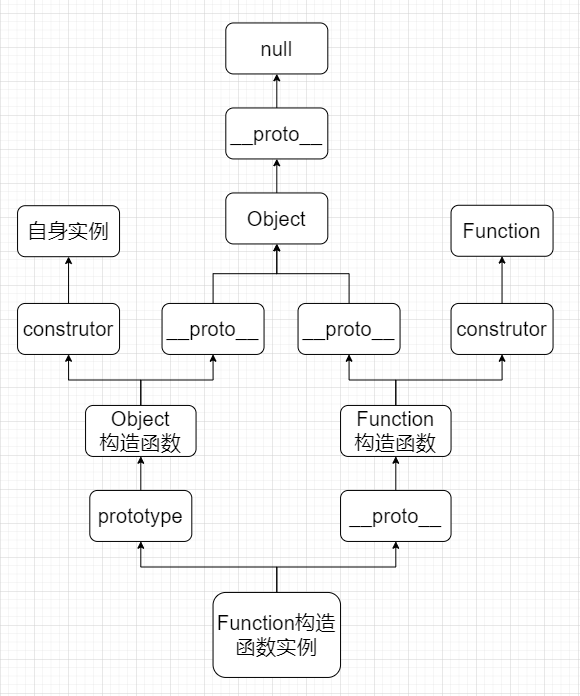

## 原型基础

MDN:

JavaScript 常被描述为一种基于原型的语言 (prototype-based language)——每个对象拥有一个原型对象，对象以其原型为模板、从原型继承方法和属性。原型对象也可能拥有原型，并从中继承方法和属性，一层一层、以此类推。这种关系常被称为原型链 (prototype chain)，它解释了为何一个对象会拥有定义在其他对象中的属性和方法。

在传统的 OOP(Object Oriented Programming) 中，首先定义“类”，此后创建对象实例时，类中定义的所有属性和方法都被复制到实例中。在 JavaScript 中并不如此复制——而是在对象实例和它的构造器之间建立一个链接（它是__proto__属性，是从构造函数的prototype属性派生的），之后通过上溯原型链，在构造器中找到这些属性和方法。

>注意: 理解对象的原型（可以通过Object.getPrototypeOf(obj)或者已被弃用的__proto__属性获得）与构造函数的prototype属性之间的区别是很重要的。前者是每个实例上都有的属性，后者是构造函数的属性。也就是说，Object.getPrototypeOf(new Foobar())和Foobar.prototype指向着同一个对象。

My mind:

- 每一个Function实例对象都有两个原型属性prototype和__proto__ ( Function实例对象 即: function(){} || new Function() )
- prototype服务于构造函数，用于创建Object实例对象
- __proto__服务于自身，用于创建函数对象



## JS的6种继承方式
### 原型链
所谓的原型链继承，就是把父类实例对象挂在到了子类的原型上。
实现方式:
```javascript
function Father() {}
Son.prototype = new Father()
function Son() {}
```
缺点：
- 共享同一个父类实例，引用的同一个内存空间。
- 不能向父类传参

### 借用构造函数
利用call改变this的特性把字类实例的this挂载到父类身上。
Class内部的super方法本质上就是借用构造函数。
```javascript
function Father() {}
function Son() {
  Father.apply(this, arguments)
}
```
缺点：
- 无法使用父类原型上的方法。

### 组合
整合原型链继承和接用构造函数继承
```javascript
function Father() {}
Son.prototype = new Father()
function Son() {
  Father.apply(this, arguments)
}
```
缺点：
- 每次创建字类父类构造函数都得执行一次。

### 原型式
封装一个函数用于创建新的Function实例，把prototype指向父类实例。
Object.create(父类实例)本质上就是原型式。
```javascript
function create(o) {
  const F = function () {}
  F.prototype = o
  return new F()
}
function Father() {}
const son = create(new Father())
```
缺点：同原型链继承。

### 寄生
把原型式继承方法二次封装。
```javascript
function create(o) {
  const F = function () {}
  F.prototype = o
  return new F()
}
function inherit(origin) {
  const obj = create(origin)
  // 配置一些属性和方法
  return obj
}
function Father() {}
const son = inherit(new Father())
```
缺点：啥也不是，封装一下也算是一种继承方式？

### 寄生组合式
结合寄生式和组合式。
```javascript
function Father() {}
function Son() {
  Father.apply(this, arguments)
}
function create(o) {
  function F() {}
  F.prototype = o
  return new F()
}
function inherit(origin, target) {
  const obj = create(origin.prototype)
  obj.constructor = target
  target.prototype = obj
}
```
缺点：没啥缺点了吧，有个瑕疵constructor可被遍历，修复一下
```javascript
function inherit(origin, target) {
  const obj = create(origin.prototype)
  Object.defineProperty(obj, 'contructor', { value: target }) // defineProperty配置后 enumerable默认为false 不可遍历
  target.prototype = obj
}
```

### 啥也不是继承方式
以上是红宝书提到的6种继承方式，下面自己实现个继承方式，欢迎指正。
```javascript
function Father() {}
function Son() {
  Father.apply(this, arguments)
}
function inherit(origin, target) {
  target.prototype = Object.create(origin.prototype, {
    constructor: {
      value: target,
    },
  })

  return target
}
inherit(Father, Son)
```

## Mixin
```javascript
const birth = {
  name: 'baby',
  cry() {
    console.log('cry')
  },
  drink() {
    console.log('drink milk')
  },
  speak() {
    return 'hello'
  },
}

const grow = {
  name: 'adult',
  make() {
    console.log('love')
  },
  write() {
    console.log(`${super.speak()} world`) // super关键字在对象中可以找到父类
  },
}
Object.setPrototypeOf(grow, birth)

const action = {
  name: 'daily',
  groan() {
    console.log('oh! yes, yes')
  },
  run() {
    console.log('go! go! go!')
  },
}

function inherit(Parent, Children, ...rest) {
  Children.prototype = Object.create(Parent.prototype, {
    constructor: {
      value: Children,
    },
  })
  mixin(Children.prototype, rest)
}

function mixin(proto, rest) {
  proto = Object.assign(proto, ...rest) // mixin 本质就是把对象的属性方法挂在到原型上
}

function Parent() {}
function Children() {
  Parent.apply(this, arguments)
}
inherit(Parent, Children, grow, action)
const children = new Children()
children.write()

function Son() {
  Parent.apply(this, arguments)
}
inherit(Parent, Son, action)
const son = new Son()
```
